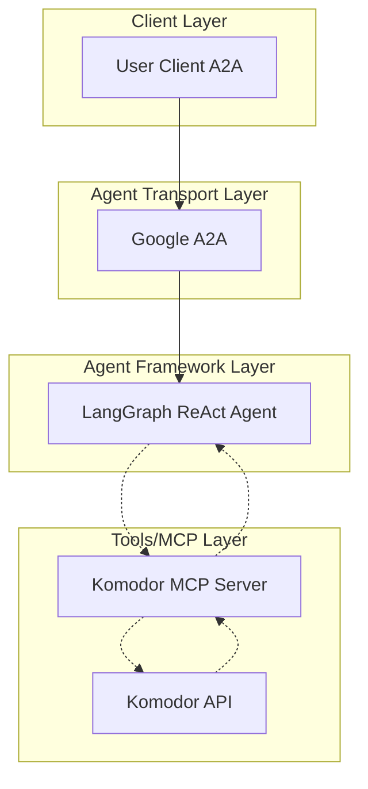

# Building a Komodor Agent (with A2A, LangGraph, MCP and Langfuse for Evaluation)

At Outshift by Cisco we use [Komodor](https://komodor.com/) to simplify our cluster management at scale. Komodor provides an AI assistant, Klaudia, that specializes in root-cause analysis (RCA). This guide shows how to use the [OpenAPI → MCP code generator](https://github.com/cnoe-io/openapi-mcp-codegen) to build an A2A-enabled LangGraph ReAct agent that calls Klaudia and Komodor APIs through MCP. The agent also ships an **eval-mode** that is used to collect a *golden dataset* to run evaluations with results & tracing uploaded to [Langfuse](https://langfuse.com/).

## Overview

We will:
- Generate an MCP server from Komodor’s OpenAPI spec
- Generate a LangGraph React agent with A2A bindings
- Optionally enable tracing/observability with Langfuse
- Build a golden dataset of expected requests/responses using **eval-mode**
- Run automated evaluation and upload results to Langfuse

## Prerequisites

- `uv` installed
- Komodor OpenAPI spec ([access here](https://api.komodor.com/api/docs/doc.json))
- LLM provider credentials (OpenAI, Azure OpenAI, etc.)
- Optional: [Langfuse deployed locally](https://langfuse.com/self-hosting/docker-compose) or accessible remotely
- Optional: [Docker](https://www.docker.com/get-started/) (for running the A2A inspector or related tooling)

## Quick Start

```bash
mkdir komodor_agent
cd komodor_agent
curl -s https://api.komodor.com/api/docs/doc.json > komodor_api.yaml
uvx --from git+https://github.com/cnoe-io/openapi-mcp-codegen.git openapi_mcp_codegen \
  --spec-file path/to/komodor_openapi.json \
  --output-dir . \
  --generate-agent \
  --generate-eval
```

## Feature Highlights

- Automatic MCP server generation from Komodor OpenAPI spec
- Tool modules for each Komodor endpoint with typed parameters
- Generated API client using httpx
- Generated LangGraph React agent with A2A server for easy client integration
- Eval-mode for building a high-quality golden dataset
- Evaluation pipeline with correctness, hallucination, and trajectory accuracy
- Optional docstring enhancement via LLM to improve developer ergonomics
- Optional Langfuse tracing and evaluation dashboards

## Architecture

The generated architecture looks like this for Komodor:



## Environment Configuration

Set your LLM and Komodor environment variables. The exact names of API_URL/TOKEN will depend on the generated package (e.g., MCP package name like mcp_komodor). Adjust as needed.

```bash
# LLM config
export LLM_PROVIDER=openai
export OPENAI_API_KEY=<your_openai_api_key>
export OPENAI_ENDPOINT=https://api.openai.com/v1
export OPENAI_MODEL_NAME=gpt-4o-mini

# Komodor API config (example; align with your generated client)
export KOMODOR_API_URL=https://api.komodor.com
export KOMODOR_API_TOKEN=<your_komodor_token>

# Optional: Langfuse (observability)
export LANGFUSE_PUBLIC_KEY=pk-lf-<public-key>
export LANGFUSE_SECRET_KEY=sk-lf-<secret-key>
export LANGFUSE_HOST=http://localhost:3000
export LANGFUSE_TRACING_ENABLED=True
```

## 1) Generate and Run an A2A-enabled Agent

- Run the generator (as shown in Quick Start).
- Start any required mock or dev server for the Komodor API if applicable, or point to a real environment.
- Launch the generated A2A agent server.
- Use an A2A client (or A2A Inspector) to send queries like: “Run RCA on namespace X for service Y” or “Explain the incident timeline for deployment Z.”

Placeholder for GIF 1: generating and running the A2A-enabled agent
[GIF: Insert screen capture showing generation, starting the agent, and a client invoking Komodor via A2A]

Example steps (adjust for the generated paths/targets):

```bash
cd examples/komodor
# If a mock server is available, run it; otherwise skip
# uv run python komodor_mock_server.py

# Start the A2A server
make run-a2a

# In a separate terminal, run a client (or use A2A Inspector)
make run-a2a-client
```

You should now be able to issue RCA or troubleshooting queries. If Langfuse is configured, you’ll see traces for prompts, tool calls, and responses.

## 2) Run eval-mode to Build a Golden Dataset of Expected Requests

Eval-mode helps you curate a set of canonical prompts and expected tool trajectories/outputs for Komodor scenarios (e.g., RCA for specific namespaces, pods, or incident patterns).

Placeholder for GIF 2: running eval-mode to build the golden dataset  
[GIF: Insert screen capture showing interactive eval-mode, selecting tools, entering queries, and saving to eval/dataset.yaml]

Steps:

```bash
cd examples/komodor
make run-a2a-eval-mode
```

- The tool lists appear with descriptions  
- Enter queries that represent real user scenarios  
- Iterate to refine the strategy and expected behavior  
- The tool stores trajectories and outputs in eval/dataset.yaml  

## 3) Run Evaluation and Upload Results to Langfuse

Once the golden dataset is ready, run the automated evaluation. The evaluation includes:
- Correctness scoring (LLM-as-judge)
- Hallucination checks
- Trajectory accuracy (graph-level)

Placeholder for GIF 3: running evaluation and seeing results in Langfuse  
[GIF: Insert screen capture showing evaluation run, dataset created in Langfuse, and dashboards with metrics]

Run:

```bash
cd examples/komodor
make eval
```

This will:
- Create a new dataset in Langfuse  
- Execute each dataset case through the agent  
- Upload results and metrics to Langfuse for analysis  

## Tips and Conventions

- Operation IDs in the Komodor OpenAPI spec become Python function names (snake_case)
- Parameters map to typed function arguments in generated tools
- API client headers (e.g., Authorization) can be configured in a config.yaml and/or via environment variables
- Use --dry-run to preview generation
- Use --enhance-docstring-with-llm to improve tool docstrings
- If you enable --generate-system-prompt, the generator crafts a SYSTEM prompt tailored to the generated Komodor tools and endpoints

## Troubleshooting

- Ensure KOMODOR_API_URL and KOMODOR_API_TOKEN are set correctly
- Check logs for HTTP status codes and validation errors
- Verify A2A server is reachable (e.g., curl http://localhost:8000/.well-known/agent.json)
- If using Langfuse, verify keys/host and that LANGFUSE_TRACING_ENABLED=True
- For A2A Inspector, follow its setup and point it to your agent URL

## Next Steps

- Expand your golden dataset with more RCA scenarios, including noisy neighbor, resource exhaustion, failing readiness probes, and misconfigurations
- Integrate into CI to catch regressions in agent reasoning or tool usage
- Share Langfuse dashboards with your team to track quality over time
