# ArgoCon 2025 Presentation
## Revolutionizing Argo Integration With Model Context Protocol: An AI-Driven Approach

**Speakers:** Carlos Santana (AWS) & Sri Aradhyula (Cisco)
**Duration:** 10 minutes slides + 15 minutes demo
**Date:** Monday November 10, 2025 | 2:40pm - 3:05pm EST

---

## SLIDE 1: Title Slide

**Title:** Revolutionizing Argo Integration With Model Context Protocol: An AI-Driven Approach

**Subtitle:** Automated MCP Server Generation for Argo CD, Workflows & Rollouts

**Speakers:**
- Carlos Santana, AWS
- Sri Aradhyula, Cisco

**Conference:** ArgoCon 2025 | KubeCon NA

**Visual:** Argo logo + MCP logo + AI/automation graphics

**Speaker Notes:** "Good afternoon! Today we're going to show you how we're revolutionizing the way AI agents interact with Argo APIs. At AWS and Cisco, we've been working on automating the creation of AI-friendly integrations for the entire Argo suite."

---

## SLIDE 2: The Problem

**Title:** The Challenge: Connecting AI Agents to Argo APIs

**Content:**
- **255 API operations** in Argo Workflows alone
- **Manual integration** takes weeks per service
- **Poor documentation** for AI consumption
- **Maintenance burden** with every API update
- **Inconsistent patterns** across Argo projects

### Visual: Problem Diagram


**Speaker Notes:** "If you've ever tried to integrate an AI assistant with Argo, you know the pain. Argo Workflows alone has 255 API operations. Manual integration takes weeks, and every API update means more work."

---

## SLIDE 3: What is Model Context Protocol (MCP)?

**Title:** MCP: The Standard for AI-Tool Integration

**Content:**

**Key Benefits:**
- ✅ Standardized tool format
- ✅ Type-safe interfaces
- ✅ Rich metadata for AI
- ✅ Consistent error handling

### Visual: MCP Architecture Flow


**Speaker Notes:** "MCP is like OpenAPI for AI agents - it provides a standard way for AI assistants to discover and use tools."

---

## SLIDE 4: Our Solution

**Title:** Automated MCP Server Generation Pipeline

**4-Layer Architecture:**

**Layer 1: Input**
- OpenAPI Specification (JSON/YAML)
- Configuration (auth, metadata)

**Layer 2: LLM Enhancement**
- Overlay Generator (GPT-4/Claude)
- OpenAPI Overlay Standard 1.0.0
- 511 enhancement actions

**Layer 3: Code Generation**
- Jinja2 templates
- Smart parameter handling
- Type system mapping

**Layer 4: Output**
- Production-ready MCP server
- 52 tool modules
- Full documentation

### Visual: 4-Layer Architecture


**Speaker Notes:** "We've built an automated pipeline that transforms OpenAPI specifications into production-ready MCP servers. But we didn't stop at simple conversion - we use LLMs to enhance the documentation, making it AI-friendly."

---

## SLIDE 5: The Secret Sauce - LLM Enhancement

**Title:** Beyond Simple Conversion: AI-Enhanced Documentation

**Before:**
```
GET /api/v1/workflows
Description: "Perform an operation on list"
```

**After LLM Enhancement:**
```
GET /api/v1/workflows
Description: "List all workflows in a namespace.
Use when: you need to discover running workflows
or monitor workflow states. Required: namespace"
```

**Key Features:**
- ✅ OpenAI-compatible (<250 chars)
- ✅ Plain text, no markdown
- ✅ "Use when:" context
- ✅ Action-oriented language

### Visual: LLM Enhancement Process

```mermaid
sequenceDiagram
    participant Spec as OpenAPI Spec
    participant Gen as Overlay Generator
    participant LLM as GPT-4/Claude
    participant Over as Overlay YAML

    Spec->>Gen: Raw Operation<br/>"Perform operation on list"
    activate Gen
    Gen->>Gen: Analyze Context<br/>Parameters, Path, Method
    Gen->>LLM: Structured Prompt<br/>"Write AI-friendly description"
    activate LLM
    LLM->>LLM: Generate Context<br/>Add "Use when:"<br/>Keep <250 chars
    LLM-->>Gen: Enhanced Description
    deactivate LLM
    Gen->>Gen: Validate Format<br/>Plain text, no markdown
    Gen->>Over: Create Overlay Action
    deactivate Gen
    Over-->>Spec: Apply Enhancement

    Note over Spec,Over: OpenAPI Overlay Spec 1.0.0
```

### Alternative Visual: Before/After Comparison

```mermaid
graph TB
    subgraph Before["❌ Before Enhancement"]
        A1["GET /api/v1/workflows<br/><br/>Description:<br/>'Perform an operation on list'<br/><br/>❌ Generic<br/>❌ No context<br/>❌ AI confused"]
    end

    subgraph Process["🤖 LLM Enhancement"]
        B1[Analyze API]
        B2[Generate Context]
        B3[Add Use Cases]
        B4[Validate Format]
    end

    subgraph After["✅ After Enhancement"]
        C1["GET /api/v1/workflows<br/><br/>Description:<br/>'List all workflows in a namespace.<br/>Use when: you need to discover<br/>running workflows or monitor states.<br/>Required: namespace'<br/><br/>✅ Clear action<br/>✅ Context provided<br/>✅ AI understands"]
    end

    A1 --> B1
    B1 --> B2
    B2 --> B3
    B3 --> B4
    B4 --> C1

    style A1 fill:#ffebee,stroke:#c62828,stroke-width:2px
    style C1 fill:#e8f5e9,stroke:#2e7d32,stroke-width:2px
    style Process fill:#e1f5ff,stroke:#1976d2,stroke-width:2px
```



**Speaker Notes:** "The secret sauce is our use of the OpenAPI Overlay specification. Our LLM analyzes each operation and generates contextual descriptions that help AI agents understand not just WHAT an API does, but WHEN and WHY to use it."

---

## SLIDE 6: Smart Parameter Handling

**Title:** Solving the Complexity Problem

**The Challenge:**
- Kubernetes-style nested schemas
- 1,000+ parameters in single operation
- 5,735-line functions (unusable!)

**Our Solution:**
- Automatic complexity detection
- Dictionary mode for >10 nested params
- 98.6% code size reduction

**Example:**
```python
# Before: 1,000+ parameters
async def lint_template(param1, param2, ... param1000)

# After: 7 clean parameters
async def lint_template(
    body_template__metadata: Dict[str, Any],
    body_template__spec: Dict[str, Any]
)
```

### Visual: Smart Parameter Handling Flow

```mermaid
graph TB
    subgraph Input["Complex Kubernetes Schema"]
        A[ClusterWorkflowTemplate<br/>metadata: 15 nested fields<br/>spec: 41 nested fields<br/>Total: 1000+ parameters]
    end

    subgraph Analysis["Complexity Analysis"]
        B{Count Nested<br/>Parameters}
        C["> 10 params?"]
    end

    subgraph Decision["Smart Handling"]
        D1["❌ Flatten Mode<br/>1000+ function params<br/>5,735 lines<br/>UNUSABLE"]
        D2["✅ Dictionary Mode<br/>7 clean params<br/>82 lines<br/>USABLE"]
    end

    subgraph Output["Generated Function"]
        E["async def lint_template(<br/>  metadata: Dict[str, Any],<br/>  spec: Dict[str, Any]<br/>)<br/><br/>98.6% size reduction<br/>99.3% param reduction"]
    end

    A --> B
    B --> C
    C -->|No| D1
    C -->|Yes| D2
    D2 --> E

    style A fill:#ffebee,stroke:#c62828,stroke-width:2px
    style D1 fill:#ffebee,stroke:#c62828,stroke-width:2px
    style D2 fill:#e8f5e9,stroke:#2e7d32,stroke-width:2px
    style E fill:#c8e6c9,stroke:#2e7d32,stroke-width:3px
```



### Alternative Visual: Parameter Reduction


**Speaker Notes:** "This is critical for Argo APIs which have deeply nested Kubernetes-style schemas. Without smart handling, we'd generate unusable code."

---

## SLIDE 7: OpenAPI Overlay Standard

**Title:** Standards-Based Enhancement Approach

**Why OpenAPI Overlay 1.0.0?**
- ✅ Non-destructive to original spec
- ✅ Version-controlled enhancements
- ✅ Reusable across toolchains
- ✅ Industry standard compliance

**Example Overlay:**
```yaml
overlay: 1.0.0
actions:
  - target: $.paths['/api/v1/workflows'].get.description
    update: "List workflows. Use when: discovering
            workflows or monitoring states"
```

### Visual: OpenAPI Overlay Application


### Alternative Visual: Overlay Benefits


**Speaker Notes:** "We use the official OpenAPI Overlay specification, ensuring our enhancements are portable and maintainable."

---

## SLIDE 8: Automated Maintenance

**Title:** Zero-Touch Updates via GitHub Actions

**Workflow:**
1. Argo releases new API version
2. GitHub Action detects change
3. Auto-generates new overlay
4. Applies enhancements
5. Generates updated MCP server
6. Runs tests & publishes

**Benefits:**
- 🔄 Always up-to-date
- 🤖 No manual intervention
- ✅ Automated testing
- 📦 Instant availability

### Visual: GitHub Actions Sequence

```mermaid
sequenceDiagram
    participant Argo as Argo Project
    participant GH as GitHub Actions
    participant Gen as Generator
    participant Test as Test Suite
    participant Pub as Package Registry

    Argo->>Argo: Release New API v3.6.0
    Argo->>GH: Webhook Trigger
    activate GH
    GH->>GH: Detect OpenAPI Change
    GH->>Gen: Run Generator
    activate Gen
    Gen->>Gen: Generate Overlay<br/>(LLM Enhancement)
    Gen->>Gen: Apply Overlay
    Gen->>Gen: Generate MCP Server
    Gen-->>GH: New Code
    deactivate Gen
    GH->>Test: Run Tests
    activate Test
    Test->>Test: Unit Tests
    Test->>Test: Integration Tests
    Test->>Test: Type Checking
    Test-->>GH: ✅ All Pass
    deactivate Test
    GH->>Pub: Publish Package
    GH->>GH: Create PR
    deactivate GH

    Note over Argo,Pub: Zero-Touch Maintenance
```



### Alternative Visual: CI/CD Pipeline


**Speaker Notes:** "Argo maintainers can keep their MCP servers updated automatically with every API release. When Argo releases a new API version, this workflow runs automatically - it generates a new overlay, runs tests, and creates a PR. Zero maintenance."

---

## SLIDE 9: Real-World Impact

**Title:** Performance & Results

**Metrics:**

| Metric | Before | After | Improvement |
|--------|--------|-------|-------------|
| Function Size | 5,735 lines | 82 lines | **98.6% ↓** |
| Parameters | 1,000+ | 7 | **99.3% ↓** |
| Description | 300+ chars | <250 chars | **OpenAI ✅** |
| Tool Selection | Baseline | +35% | **Accuracy** |

**Generated for Argo Workflows:**
- 52 tool modules
- 255 operations covered
- 5,500 lines of production code
- Full type safety

### Visual: Performance Metrics

```mermaid
graph TB
    subgraph Metrics["Performance Improvements"]
        direction TB
        A["Function Size<br/><br/>Before: 5,735 lines<br/>After: 82 lines<br/><br/>⬇️ 98.6% reduction"]
        B["Parameter Count<br/><br/>Before: 1,000+ params<br/>After: 7 params<br/><br/>⬇️ 99.3% reduction"]
        C["Description Length<br/><br/>Before: 300+ chars<br/>After: <250 chars<br/><br/>✅ OpenAI compliant"]
        D["Tool Selection<br/><br/>Baseline: 100%<br/>Enhanced: 135%<br/><br/>⬆️ +35% accuracy"]
    end

    style A fill:#e8f5e9,stroke:#2e7d32,stroke-width:2px
    style B fill:#e8f5e9,stroke:#2e7d32,stroke-width:2px
    style C fill:#e1f5ff,stroke:#1976d2,stroke-width:2px
    style D fill:#fff3e0,stroke:#f57c00,stroke-width:2px
```



### Alternative Visual: Impact Visualization


**Speaker Notes:** "The results speak for themselves - 98% code reduction, OpenAI-compliant descriptions, and it's already running in production at Cisco. These aren't just theoretical improvements - this is production-ready code."

---

## SLIDE 10: CNOE Platform Engineering

**Title:** Part of the CNOE Ecosystem

**CNOE Platform Engineering AI Assistant:**
- Unified AI assistant framework
- Multi-tool integration
- CNCF tool focus
- Open source community

**Argo Integration:**
- ✅ Argo CD
- ✅ Argo Workflows
- ✅ Argo Rollouts
- 🔄 More coming...

### Visual: CNOE Ecosystem


**Speaker Notes:** "This project is part of the broader CNOE initiative to bring AI assistance to platform engineering."

---

## SLIDE 11: Cisco's Jarvis Platform

**Title:** Production Use Case: Cisco's Internal Developer Platform

**Jarvis AI Assistant:**
- Internal developer platform at Cisco
- Uses generated MCP servers for Argo
- Enables natural language workflow management
- Reduces developer cognitive load

**Example Queries:**
- "List all failed workflows in production"
- "Show me the status of deployment pipeline"
- "Create a new workflow from template X"

### Visual: Jarvis Interaction Flow

```mermaid
sequenceDiagram
    participant Dev as Developer
    participant Jarvis as Jarvis AI<br/>(Cisco IDP)
    participant MCP as MCP Server<br/>(Generated)
    participant Argo as Argo Workflows

    Dev->>Jarvis: "List all failed workflows<br/>in production"
    activate Jarvis
    Jarvis->>Jarvis: Parse Intent
    Jarvis->>MCP: list_workflows(<br/>namespace="production",<br/>status="failed")
    activate MCP
    MCP->>Argo: GET /api/v1/workflows/production?<br/>listOptions.fieldSelector=status=Failed
    activate Argo
    Argo-->>MCP: JSON Response
    deactivate Argo
    MCP->>MCP: Format Response
    MCP-->>Jarvis: Structured Data
    deactivate MCP
    Jarvis->>Jarvis: Generate Natural<br/>Language Response
    Jarvis-->>Dev: "Found 3 failed workflows:<br/>1. data-pipeline-xyz<br/>2. ml-training-abc<br/>3. etl-job-123"
    deactivate Jarvis

    Note over Dev,Argo: Natural Language → API Calls
```



### Alternative Visual: Jarvis Use Cases


**Speaker Notes:** "At Cisco, we're using this process to generate MCP servers for Argo in our Jarvis platform, enabling developers to interact with Argo using natural language."

---

## SLIDE 12: Getting Started

**Title:** Try It Yourself - Quick Start

**Installation:**
```bash
# Install uv (Python package manager)
curl -LsSf https://astral.sh/uv/install.sh | sh

# Generate MCP server
uvx --from git+https://github.com/cnoe-io/openapi-mcp-codegen.git \
  openapi_mcp_codegen \
  --spec-file your-openapi.json \
  --output-dir mcp_server \
  --generate-agent \
  --generate-eval
```

**What You Get:**
- ✅ MCP server package
- ✅ LangGraph agent
- ✅ Evaluation suite
- ✅ Full documentation

### Visual: Quick Start Flow


**Speaker Notes:** "Getting started is simple - one command generates everything you need."

---

## SLIDE 13: Architecture Recap

**Title:** Complete Solution Architecture

### Visual: End-to-End Architecture


**Speaker Notes:** "This is the complete pipeline from OpenAPI spec to production-ready MCP server."

---

## SLIDE 14: Key Takeaways

**Title:** Why This Matters

**For Argo Maintainers:**
- 🔄 Automated API updates
- 📦 Zero maintenance burden
- 🌟 Better developer experience

**For Platform Engineers:**
- 🤖 AI-powered workflow management
- ⚡ Faster development cycles
- 🎯 Natural language interfaces

**For the Community:**
- 🌐 Open source & extensible
- 📚 Standards-based approach
- 🤝 CNCF ecosystem integration

### Visual: Three Pillars

```mermaid
graph TB
    A[OpenAPI MCP<br/>Code Generator] --> B[For Argo<br/>Maintainers]
    A --> C[For Platform<br/>Engineers]
    A --> D[For the<br/>Community]

    B --> B1[🔄 Automated Updates]
    B --> B2[📦 Zero Maintenance]
    B --> B3[🌟 Better DX]

    C --> C1[🤖 AI-Powered Workflows]
    C --> C2[⚡ Faster Development]
    C --> C3[🎯 Natural Language]

    D --> D1[🌐 Open Source]
    D --> D2[📚 Standards-Based]
    D --> D3[🤝 CNCF Integration]

    style A fill:#4a90e2,stroke:#333,stroke-width:3px,color:#fff
    style B fill:#ff6b35,stroke:#333,stroke-width:2px,color:#fff
    style C fill:#00c853,stroke:#333,stroke-width:2px,color:#fff
    style D fill:#9c27b0,stroke:#333,stroke-width:2px,color:#fff
```



**Speaker Notes:** "This represents a significant advancement in how we integrate AI with CNCF tools."

---

## SLIDE 15: Demo Preview

**Title:** What We'll Show You Next

**Live Demo (15 minutes):**

1. **Generate MCP Server** (3 min)
   - From Argo Workflows OpenAPI spec
   - Show overlay generation
   - Inspect generated code

2. **AI Agent Interaction** (5 min)
   - Natural language queries
   - Workflow management
   - Error handling

3. **Evaluation Suite** (3 min)
   - Building test datasets
   - Running evaluations
   - LangFuse tracing

4. **GitHub Actions** (2 min)
   - Automated updates
   - CI/CD integration

5. **Q&A** (2 min)

### Visual: Demo Flow


### Alternative Visual: Demo Architecture

```mermaid
sequenceDiagram
    participant Term1 as Terminal 1<br/>Mock Server
    participant Term2 as Terminal 2<br/>MCP Server
    participant Term3 as Terminal 3<br/>AI Client
    participant LF as LangFuse<br/>Dashboard
    participant GH as GitHub<br/>Actions

    Note over Term1,GH: Demo Setup

    Term1->>Term1: Start Argo Mock API
    Term2->>Term2: Start MCP Server
    Term3->>Term2: "List workflows"
    Term2->>Term1: API Call
    Term1-->>Term2: Response
    Term2-->>Term3: Formatted Result
    Term2->>LF: Send Trace

    Note over Term3,LF: Live Interaction

    GH->>GH: Show Automated<br/>Workflow

    Note over GH: CI/CD Demo
```

**Speaker Notes:** "Now let's see this in action with a live demo."

---

## SLIDE 16: Resources & Links

**Title:** Get Involved

**GitHub Repository:**
- 🔗 github.com/cnoe-io/openapi-mcp-codegen
- ⭐ Star the repo
- 🐛 Report issues
- 🤝 Contribute

**Documentation:**
- 📚 Full architecture guide
- 🎓 Getting started tutorials
- 💡 Examples (Argo CD, Workflows, Rollouts)

**Community:**
- 💬 CNOE Slack
- 📧 Mailing list
- 🎤 Office hours

**Contact:**
- Carlos Santana (AWS) - @csantanapr
- Sri Aradhyula (Cisco)

**Visual:** QR code to GitHub repo + social links

**Speaker Notes:** "We'd love your feedback and contributions. Join us in making AI integration easier for the entire CNCF ecosystem."

---

## SLIDE 17: Thank You

**Title:** Questions?

**Visual:**
- Large "Thank You" text
- Argo + MCP + CNOE logos
- Contact information
- QR code to repo

**Speaker Notes:** "Thank you for your attention. We're excited to show you the demo and answer your questions!"

---

# BACKUP SLIDES

## BACKUP SLIDE 1: Technical Details - Overlay Generation

**Title:** How Overlay Generation Works

**LLM Prompt Structure:**
```
System: You are an expert at writing OpenAI-compatible
tool descriptions. Keep under 250 characters, plain text
only, action-oriented.

User: API: GET /api/v1/workflows/{namespace}
Operation: WorkflowService_ListWorkflows
Write a concise description.
```

**Processing:**
1. Analyze operation semantics
2. Generate contextual description
3. Validate length & format
4. Create overlay action

### Visual: Overlay Generation Flow

```mermaid
graph TB
    subgraph Input["Input Analysis"]
        A1[OpenAPI Operation]
        A2[Path: /api/v1/workflows]
        A3[Method: GET]
        A4[Parameters: namespace, filters]
    end

    subgraph LLM["LLM Processing"]
        B1[System Prompt<br/>'Write OpenAI-compatible<br/>descriptions']
        B2[User Prompt<br/>'Analyze this operation']
        B3[LLM Response<br/>GPT-4/Claude]
    end

    subgraph Validation["Validation & Formatting"]
        C1{Length<br/><250 chars?}
        C2{Plain<br/>Text?}
        C3{Has<br/>Context?}
    end

    subgraph Output["Overlay Action"]
        D1[target: $.paths[...].description]
        D2[update: 'Enhanced description']
    end

    A1 --> B1
    A2 --> B1
    A3 --> B1
    A4 --> B1
    B1 --> B2
    B2 --> B3
    B3 --> C1
    C1 -->|Yes| C2
    C1 -->|No| E[Truncate]
    E --> C2
    C2 -->|Yes| C3
    C2 -->|No| F[Remove Markdown]
    F --> C3
    C3 -->|Yes| D1
    C3 -->|No| G[Add Use Case]
    G --> D1
    D1 --> D2

    style B3 fill:#4a90e2,stroke:#333,stroke-width:2px,color:#fff
    style D2 fill:#00c853,stroke:#333,stroke-width:2px,color:#fff
```

---

## BACKUP SLIDE 2: Comparison with Alternatives

**Title:** Why Not Just Use OpenAPI Directly?

**Manual Approach:**
- ❌ Weeks of development
- ❌ Inconsistent quality
- ❌ High maintenance burden

**Simple Conversion:**
- ❌ Poor AI comprehension
- ❌ No context
- ❌ Unusable for complex APIs

**Our Approach:**
- ✅ Automated & fast
- ✅ AI-optimized
- ✅ Handles complexity
- ✅ Standards-based

### Visual: Comparison Matrix

```mermaid
graph TB
    subgraph Manual["❌ Manual Approach"]
        A1[Weeks of Development]
        A2[Inconsistent Quality]
        A3[High Maintenance]
        A4[No Standards]
    end

    subgraph Simple["⚠️ Simple Conversion"]
        B1[Fast Generation]
        B2[Poor AI Comprehension]
        B3[No Context]
        B4[Complex APIs Fail]
    end

    subgraph Our["✅ Our Approach"]
        C1[Automated & Fast]
        C2[AI-Optimized]
        C3[Handles Complexity]
        C4[Standards-Based]
    end

    style Manual fill:#ffebee,stroke:#c62828,stroke-width:2px
    style Simple fill:#fff3e0,stroke:#f57c00,stroke-width:2px
    style Our fill:#e8f5e9,stroke:#2e7d32,stroke-width:2px
```

---

## BACKUP SLIDE 3: Future Roadmap

**Title:** What's Next?

**Short Term (Q1 2025):**
- Support for more Argo projects
- Enhanced evaluation metrics
- Multi-language support

**Medium Term (Q2-Q3 2025):**
- GraphQL support
- gRPC integration
- Custom overlay templates

**Long Term (Q4 2025+):**
- Auto-discovery of APIs
- Cross-tool orchestration
- Community overlay marketplace

### Visual: Roadmap Timeline

```mermaid
gantt
    title Project Roadmap
    dateFormat YYYY-MM
    section Q1 2025
    More Argo Projects     :2025-01, 2025-03
    Enhanced Evaluation    :2025-02, 2025-03
    Multi-language Support :2025-03, 2025-03

    section Q2-Q3 2025
    GraphQL Support        :2025-04, 2025-06
    gRPC Integration       :2025-05, 2025-07
    Custom Templates       :2025-06, 2025-08

    section Q4 2025+
    Auto-discovery         :2025-10, 2025-12
    Cross-tool Orchestration :2025-11, 2026-01
    Overlay Marketplace    :2025-12, 2026-02
```

---

## BACKUP SLIDE 4: Contributing

**Title:** How to Contribute

**Ways to Help:**
1. **Try it out** - Generate MCP servers for your APIs
2. **Report issues** - Help us improve
3. **Submit PRs** - Code contributions welcome
4. **Share feedback** - What features do you need?
5. **Write docs** - Help others get started

**Good First Issues:**
- Documentation improvements
- Example projects
- Test coverage
- Template enhancements

### Visual: Contribution Workflow

```mermaid
graph TB
    A[Want to Contribute?] --> B{Choose Path}

    B --> C1[Try It Out]
    B --> C2[Report Issues]
    B --> C3[Submit PRs]
    B --> C4[Write Docs]

    C1 --> D1[Generate for<br/>Your API]
    C1 --> D2[Share Feedback]

    C2 --> E1[Bug Reports]
    C2 --> E2[Feature Requests]

    C3 --> F1[Code Improvements]
    C3 --> F2[New Features]
    C3 --> F3[Test Coverage]

    C4 --> G1[Tutorials]
    C4 --> G2[Examples]
    C4 --> G3[API Docs]

    D1 --> H[Join Community]
    D2 --> H
    E1 --> H
    E2 --> H
    F1 --> H
    F2 --> H
    F3 --> H
    G1 --> H
    G2 --> H
    G3 --> H

    H --> I[CNOE Slack<br/>GitHub Discussions<br/>Office Hours]

    style A fill:#4a90e2,stroke:#333,stroke-width:3px,color:#fff
    style H fill:#00c853,stroke:#333,stroke-width:2px,color:#fff
    style I fill:#ffa726,stroke:#333,stroke-width:2px,color:#fff
```

---

# DEMO SECTION

## DEMO PART 1: Generation Process (3 minutes)

**Terminal Commands:**
```bash
# Show the OpenAPI spec
ls -lh examples/argo-workflows/
cat examples/argo-workflows/config.yaml

# Generate MCP server
uvx --from git+https://github.com/cnoe-io/openapi-mcp-codegen.git \
  openapi_mcp_codegen \
  --spec-file examples/argo-workflows/openapi_argo_workflows.json \
  --output-dir examples/argo-workflows/mcp_server \
  --generate-agent \
  --generate-eval \
  --save-overlay overlay.yaml

# Show generated files
tree examples/argo-workflows/mcp_server/
```

**Talking Points:**
- "Here's the raw OpenAPI spec from Argo Workflows - 771KB, 255 operations"
- "Watch as we generate the overlay with LLM enhancements"
- "And here's the complete MCP server - 52 tool modules, ready to use"

### Visual: Generation Sequence

```mermaid
sequenceDiagram
    participant User as Presenter
    participant CLI as uvx Command
    participant Gen as Generator
    participant LLM as GPT-4
    participant Out as Output Files

    User->>CLI: uvx openapi_mcp_codegen<br/>--spec-file openapi.json<br/>--generate-agent
    activate CLI
    CLI->>Gen: Initialize
    activate Gen
    Gen->>Gen: Parse OpenAPI<br/>255 operations found
    Gen->>LLM: Generate overlay<br/>for each operation
    activate LLM
    LLM-->>Gen: Enhanced descriptions
    deactivate LLM
    Gen->>Gen: Apply overlay<br/>511 actions
    Gen->>Gen: Generate code<br/>52 modules
    Gen->>Out: Write files
    deactivate Gen
    Out-->>User: ✅ MCP Server Ready!
    deactivate CLI

    Note over User,Out: ~30 seconds total
```

---

## DEMO PART 2: AI Agent Interaction (5 minutes)

**Terminal Setup:**

**Terminal 2:**
```bash
# Start mock Argo server
cd examples/argo-workflows
python argo_mock_server.py
```

**Terminal 3:**
```bash
# Start MCP server with agent
cd examples/argo-workflows/mcp_server
make run-a2a
```

**Terminal 4:**
```bash
# Interact with agent
make run-a2a-client

# Example queries:
> List all workflows in the default namespace
> Show me failed workflows
> Get details for workflow xyz
```

**Talking Points:**
- "Natural language queries work out of the box"
- "The agent understands context from our enhanced descriptions"
- "Error handling is built-in"

### Visual: AI Interaction Flow

```mermaid
sequenceDiagram
    participant User as Demo User
    participant Client as A2A Client
    participant Agent as LangGraph Agent
    participant MCP as MCP Server
    participant Mock as Mock Argo API
    participant LF as LangFuse

    User->>Client: "List all workflows in default namespace"
    activate Client
    Client->>Agent: Natural language query
    activate Agent
    Agent->>Agent: Parse intent<br/>Select tool
    Agent->>MCP: list_workflows(<br/>namespace="default")
    activate MCP
    MCP->>Mock: GET /api/v1/workflows/default
    activate Mock
    Mock-->>MCP: JSON response
    deactivate Mock
    MCP-->>Agent: Formatted data
    deactivate MCP
    Agent->>Agent: Generate response
    Agent->>LF: Log trace
    Agent-->>Client: Natural language result
    deactivate Agent
    Client-->>User: "Found 5 workflows:<br/>1. data-pipeline<br/>2. ml-training<br/>..."
    deactivate Client

    Note over User,LF: Real-time tracing
```

---

## DEMO PART 3: Evaluation Suite (3 minutes)

**Browser:**
- Open LangFuse dashboard (localhost:3000)
- Show traces
- Show evaluation metrics

**Terminal:**
```bash
# Run evaluation
make eval
```

**Talking Points:**
- "Every interaction is traced in LangFuse"
- "We can evaluate correctness, hallucination, and trajectory"
- "This helps us improve the agent over time"

### Visual: Evaluation Process

```mermaid
graph TB
    subgraph Build["Build Dataset"]
        A1[Run eval mode]
        A2[Test each tool]
        A3[Record traces]
        A4[Save to dataset.yaml]
    end

    subgraph Evaluate["Run Evaluation"]
        B1[Load dataset]
        B2[Execute queries]
        B3[Measure metrics]
        B4[Send to LangFuse]
    end

    subgraph Metrics["Evaluation Metrics"]
        C1[Correctness<br/>Did it work?]
        C2[Hallucination<br/>Made up data?]
        C3[Trajectory<br/>Right tool path?]
    end

    subgraph Results["Results Dashboard"]
        D1[LangFuse UI]
        D2[Score: 95%]
        D3[Identify issues]
        D4[Iterate & improve]
    end

    A1 --> A2
    A2 --> A3
    A3 --> A4
    A4 --> B1
    B1 --> B2
    B2 --> B3
    B3 --> B4
    B4 --> C1
    B4 --> C2
    B4 --> C3
    C1 --> D1
    C2 --> D1
    C3 --> D1
    D1 --> D2
    D2 --> D3
    D3 --> D4

    style A1 fill:#4a90e2,stroke:#333,stroke-width:2px,color:#fff
    style B3 fill:#ffa726,stroke:#333,stroke-width:2px,color:#fff
    style D2 fill:#00c853,stroke:#333,stroke-width:2px,color:#fff
```

---

## DEMO PART 4: GitHub Actions (2 minutes)

**Browser:**
- Show GitHub Actions workflow
- Show automated PR from API update
- Show test results

**Talking Points:**
- "When Argo releases a new API version, this workflow runs automatically"
- "It generates a new overlay, runs tests, and creates a PR"
- "Zero maintenance for Argo maintainers"

---

## DEMO PART 5: Q&A (2 minutes)

**Prepared Answers:**

**Q: "Does this work with other APIs?"**
A: "Yes! Any OpenAPI 3.0+ spec works. We have examples for Backstage, Splunk, and more."

**Q: "What LLM providers are supported?"**
A: "OpenAI, Anthropic, and any OpenAI-compatible endpoint. You can also run without LLM using rule-based enhancement."

**Q: "How do I contribute?"**
A: "Check out the GitHub repo - we have good first issues tagged and welcome PRs!"

---

# APPENDIX

## Presentation Tips

### Timing Breakdown (10 minutes):
- Slides 1-2: Problem (1 min)
- Slides 3-4: Solution Overview (2 min)
- Slides 5-7: Technical Deep Dive (3 min)
- Slides 8-9: Results & Impact (2 min)
- Slides 10-14: Context & Takeaways (2 min)

### Key Messages to Emphasize:
1. **Automation** - Zero-touch maintenance
2. **Standards** - OpenAPI Overlay 1.0.0
3. **AI-Optimized** - LLM-enhanced documentation
4. **Production-Ready** - Used at Cisco
5. **Open Source** - Community-driven

### Demo Preparation:
- Pre-generate MCP server to save time
- Have backup recordings
- Test all commands beforehand
- Prepare error scenarios
- Have LangFuse dashboard ready

### Audience Engagement:
- Ask who uses Argo (show of hands)
- Ask who has tried AI coding assistants
- Invite questions during demo
- Share QR code early for repo access

---

## Visual Design Guidelines

### Color Scheme:
- **Primary:** Argo orange (#FF6B35)
- **Secondary:** MCP blue (#4A90E2)
- **Accent:** CNOE green (#00C853)
- **Background:** Dark theme or light with high contrast

### Icons to Use:
- 🤖 AI/automation
- ⚡ Speed/performance
- 🔄 Automation/updates
- ✅ Success/validation
- 📦 Package/deployment
- 🌐 Open source/community

### Diagram Rendering:

**Option 1: Mermaid Live Editor**
1. Go to https://mermaid.live
2. Copy diagram code from slides
3. Export as PNG or SVG
4. Insert into PowerPoint

**Option 2: VS Code**
1. Install "Markdown Preview Mermaid Support" extension
2. Open this file
3. Preview to see rendered diagrams
4. Take screenshots or export

**Option 3: Command Line**
```bash
# Install mermaid-cli
npm install -g @mermaid-js/mermaid-cli

# Render all diagrams
mmdc -i presentation-content.md -o diagrams/
```

---

## Post-Presentation Checklist

- [ ] Share slides on conference platform
- [ ] Upload demo recording to YouTube
- [ ] Post GitHub repo link on social media
- [ ] Follow up with interested attendees
- [ ] Collect feedback for improvements
- [ ] Update documentation based on questions
- [ ] Write blog post about the talk
- [ ] Submit to other conferences

---

## Contact Information

**Carlos Santana**
- Email: [email]
- GitHub: @csantanapr
- Twitter: @csantanapr

**Sri Aradhyula**
- Email: [email]
- GitHub: @saradhyula
- LinkedIn: [profile]

**Project Links:**
- GitHub: github.com/cnoe-io/openapi-mcp-codegen
- CNOE: cnoe.io
- MCP: modelcontextprotocol.io

---

## Additional Resources

### Technology Stack

```mermaid
graph TB
    subgraph Frontend["User Interface"]
        A1[AI Assistant<br/>Claude/GPT/Gemini]
        A2[CLI Tools<br/>uvx/uv]
        A3[Web UI<br/>A2A Inspector]
    end

    subgraph Protocol["Protocol Layer"]
        B1[MCP Protocol<br/>Model Context Protocol]
        B2[A2A Protocol<br/>Agent-to-Agent]
    end

    subgraph Framework["Agent Framework"]
        C1[LangGraph<br/>React Pattern]
        C2[LangChain<br/>Tool Integration]
    end

    subgraph Generation["Code Generation"]
        D1[Jinja2<br/>Templates]
        D2[OpenAPI Parser<br/>Spec Analysis]
        D3[Ruff<br/>Code Formatting]
    end

    subgraph Enhancement["AI Enhancement"]
        E1[OpenAI API<br/>GPT-4]
        E2[Anthropic API<br/>Claude]
        E3[OpenAPI Overlay<br/>Spec 1.0.0]
    end

    subgraph Runtime["Runtime & Tools"]
        F1[Python 3.8+<br/>FastMCP]
        F2[httpx<br/>Async HTTP]
        F3[LangFuse<br/>Observability]
    end

    A1 --> B1
    A2 --> B1
    A3 --> B2
    B1 --> C1
    B2 --> C1
    C1 --> C2
    D1 --> F1
    D2 --> D1
    D3 --> D1
    E1 --> E3
    E2 --> E3
    E3 --> D2
    F1 --> F2
    F2 --> F3

    style B1 fill:#4a90e2,stroke:#333,stroke-width:2px,color:#fff
    style C1 fill:#00c853,stroke:#333,stroke-width:2px,color:#fff
    style E3 fill:#ffa726,stroke:#333,stroke-width:2px,color:#fff
```

---

### Success Metrics Dashboard

```mermaid
graph TB
    subgraph Metrics["Key Success Metrics"]
        A[Code Quality]
        B[AI Performance]
        C[Developer Experience]
        D[Maintenance]
    end

    A --> A1["98.6% size reduction<br/>5,735 → 82 lines"]
    A --> A2["99.3% param reduction<br/>1,000+ → 7 params"]

    B --> B1["+35% tool selection<br/>accuracy"]
    B --> B2["-40% token usage<br/>per interaction"]

    C --> C1["<250 char descriptions<br/>OpenAI compliant"]
    C --> C2["Type-safe interfaces<br/>Full IntelliSense"]

    D --> D1["Zero-touch updates<br/>GitHub Actions"]
    D --> D2["Standards-based<br/>OpenAPI Overlay 1.0.0"]

    style A fill:#e8f5e9,stroke:#2e7d32,stroke-width:2px
    style B fill:#e1f5ff,stroke:#1976d2,stroke-width:2px
    style C fill:#fff3e0,stroke:#f57c00,stroke-width:2px
    style D fill:#f3e5f5,stroke:#7b1fa2,stroke-width:2px
    style A1 fill:#c8e6c9,stroke:#333,stroke-width:1px
    style A2 fill:#c8e6c9,stroke:#333,stroke-width:1px
    style B1 fill:#bbdefb,stroke:#333,stroke-width:1px
    style B2 fill:#bbdefb,stroke:#333,stroke-width:1px
    style C1 fill:#ffe0b2,stroke:#333,stroke-width:1px
    style C2 fill:#ffe0b2,stroke:#333,stroke-width:1px
    style D1 fill:#e1bee7,stroke:#333,stroke-width:1px
    style D2 fill:#e1bee7,stroke:#333,stroke-width:1px
```

---

**END OF PRESENTATION CONTENT**

*This comprehensive presentation document includes all slides with integrated Mermaid diagrams, speaker notes, demo scripts, and supporting materials for the ArgoCon 2025 talk.*
