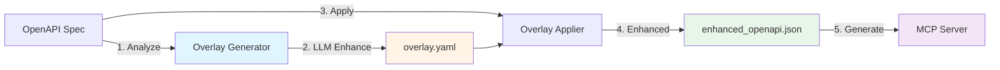

# 🚀 OpenAPI to MCP Server Code Generator

[](https://www.python.org/)
[](LICENSE)
[](https://github.com/cnoe-io/openapi-mcp-codegen/actions/workflows/conventional_commits.yml)
[](https://github.com/cnoe-io/openapi-mcp-codegen/actions/workflows/ruff.yml)
[](https://github.com/cnoe-io/openapi-mcp-codegen/actions/workflows/superlinter.yml)
[](https://github.com/cnoe-io/openapi-mcp-codegen/actions/workflows/unittest.yaml)
[](https://github.com/cnoe-io/openapi-mcp-codegen/actions/workflows/dependabot/dependabot-updates)

## Overview

This tool generates **Model Context Protocol (MCP) servers** from OpenAPI specifications, creating Python packages that can be used by AI assistants to interact with APIs. The core architecture transforms OpenAPI specs into structured MCP servers with tools, models, and client code.

## Quick Start

- Install uv
- Generate server (and optionally agent/eval):
  ```bash
  uvx --from git+https://github.com/cnoe-io/openapi-mcp-codegen.git openapi_mcp_codegen \
    --spec-file examples/petstore/openapi_petstore.json \
    --output-dir examples/petstore \
    --generate-agent \
    --generate-eval
  ```

## ✨ Features

- ⚡ Automatic MCP server generation from OpenAPI specs
- 📝 Supports JSON and YAML formats
- 🛠️ Tool modules for each API endpoint
- 🤖 API client code generation
- 📋 Logging & error handling setup
- ⚙️ Configuration files (`pyproject.toml`, `.env.example`)
- 📚 Comprehensive documentation generation
- 🚀 **--generate-agent** flag – additionally produces a LangGraph
  React agent (with A2A server, Makefile, README and .env.example)
  alongside the generated MCP server
- 📊 **--generate-eval**: adds interactive eval mode and automated evaluation suite
- 🧠 **--generate-system-prompt**: generates a SYSTEM prompt for the agent using your configured LLM
- 🔌 Optional [SLIM](https://github.com/agntcy/slim) transport support is available (see Experimental section)

## How It Works

- You provide an OpenAPI spec (JSON or YAML).
- The generator parses paths, operations, and schemas, then renders Jinja2 templates into a structured Python MCP server.
- Optionally, it generates an accompanying LangGraph agent and A2A server wrapper that can call the generated MCP tools.
- Also supports tracing and evaluation using [LangFuse](https://github.com/langfuse/langfuse).

## Development

### Local Development Commands

```bash
# Setup venv
uv venv && source .venv/bin/activate

# Initial setup (requires uv CLI)
uv sync
```

## CLI Options

- **--generate-agent**
  - Produces a LangGraph React agent that wraps the generated MCP server
  - Includes A2A server, Makefile, README, and .env.example
- **--generate-eval**
  - Adds:
    - eval_mode.py (interactive dataset builder that stores traces in eval/dataset.yaml)
    - eval/evaluate_agent.py (LangFuse-powered evaluation using correctness, hallucination, and trajectory accuracy)
- **--generate-system-prompt**
  - Uses your configured LLM to create a SYSTEM prompt tailored to the generated tools
- **--enhance-docstring-with-llm**
  - Optionally rewrites tool docstrings using an LLM
- **--enable-slim**
  - Bridges the generated A2A Starlette application to SLIM via AgntcyFactory and generates a docker-compose file to bring up the services

## Generated Architecture

## 🏗️ Architecture


The generated architecture includes an MCP server in STDIO mode and two built-in utility tools: get_current_time and iso8601_to_unix.

## Example: Petstore A2A LangGraph agent + MCP Server


1. Generate the agent + evals

```
uvx --from git+https://github.com/cnoe-io/openapi-mcp-codegen.git openapi_mcp_codegen \
  --spec-file examples/petstore/openapi_petstore.json \
  --output-dir examples/petstore \
  --generate-agent \
  --generate-eval
```

2. Configure your agent + LLM (see [LLM provider docs](https://cnoe-io.github.io/ai-platform-engineering/getting-started/docker-compose/configure-llms)) and Langfuse docs on [deploying using docker-compose](https://langfuse.com/self-hosting/deployment/docker-compose) and [creating API keys](https://langfuse.com/faq/all/where-are-langfuse-api-keys).
```
cat > .env << 'EOF'
# Petstore API
PETSTORE_API_URL=http://0.0.0.0:10000
PETSTORE_TOKEN=foo

# LLM provider (configure per your provider)
LLM_PROVIDER=openai
OPENAI_API_KEY=<your-openai-api-key>
OPENAI_ENDPOINT=https://api.openai.com/v1
OPENAI_MODEL_NAME=gpt-5

# Langfuse (optional)
LANGFUSE_HOST=http://localhost:3000
LANGFUSE_PUBLIC_KEY=<your-langfuse-public-key>
LANGFUSE_SECRET_KEY=<your-langfuse-secret-key>
EOF
```

Also export the variables into your shell:
```bash
# Exports each line of the .env ignoring lines starting with #
export $(grep -v '^#' .env | xargs)
```

3. Go to the agent directory and run the mock server:

```
cd examples/petstore
uv run python petstore_mock_server.py
```

4. In a new terminal from the root of the git repo:

```
cd examples/petstore
make run-a2a
```

5. In a new terminal from the root of the git repo ([install Docker first](https://www.docker.com/get-started/)):
```
cd examples/petstore
make run-a2a-client
```

You now have an agent and client deployed, e.g. ask `List my available pets`. You can see tracing in LangFuse (http://localhost:3000) if enabled. Follow the next steps to evaluate your agent:

6. In a new terminal start the agent in eval mode. This will output the list of tools and prompt you to evaluate each one and build the dataset in `eval/dataset.yaml`

```
make run-a2a-eval-mode
```

7. Once you are done building the dataset, launch the evaluation:
```
make eval
```

This creates a new dataset in LangFuse and triggers an evaluation run.

### Extension: SLIM

This section requires `host.docker.internal` to be accessible. See [this GitHub issue](https://github.com/docker/for-mac/issues/7332) if you encounter any problems.

8. If you generated with **--enable-slim**, you can also run the A2A server over SLIM and auto-start a local SLIM dataplane via docker-compose:
```
export PETSTORE_API_URL=http://host.docker.internal:10000  # Needed so that the MCP server can talk to the mock API server running on the host
make run-a2a-and-slim
```
This docker-compose:
- Runs two containers: one A2A over HTTP and one A2A bridged to SLIM,
- starts a slim-dataplane service defined in slim-config.yaml,
- wires Langfuse into both containers (assuming `host.docker.internal` is accessible, alternatively add the langfuse components to the generate docker-compose file and update the `LANGFUSE_HOST` environment variable to `http://langfuse-web:3000`).

9. To connect to the SLIM-bridged agent from the client in a new terminal run:
```
make run-slim-client
```

## A2A Inspector Tool

The A2A Inspector is a utility for inspecting and debugging A2A servers. It provides a visual interface to explore agent cards and invoke the agent. Follow the instructions [on the project page](https://github.com/a2aproject/a2a-inspector) to build and run the inspector, which should be available at localhost:8080. You can then connect to the agent running on `localhost:8000/.well-known/agent.json`.

## Project-Specific Conventions

### Configuration Files

- Each example requires `config.yaml` with metadata such as authorization headers
- Generated `pyproject.toml` includes agent-specific dependencies
- `.env.example` templates include agent-specific environment variables

### Code Generation Patterns

- Operation IDs become Python function names (snake_case conversion)
- OpenAPI parameters map to function arguments with type hints
- Generated tools follow pattern: `async def operation_id(params) -> Any`
- API client uses `httpx` with configurable base URLs and headers

## Integration Points

### External Dependencies

- MCP Protocol: Uses `mcp>=1.9.0` for FastMCP server implementation
- uv Package Manager: Required for dependency management and execution
- Jinja2: Template engine for code generation
- Ruff: Code formatting and linting (auto-applied to generated code)

## Key Files for Understanding

- `openapi_mcp_codegen/mcp_codegen.py`: Core generation logic and template rendering
- `openapi_mcp_codegen/templates/`: Template structure mirrors output structure
- `examples/petstore/`: Complete working example with OpenAPI spec and config
- `tests/test_mcp_codegen.py`: Integration tests showing expected generation flow

## Experimental

### SLIM Support

Use **--enable-slim** to build an agent that can run its A2A server over the SLIM transport.

- When generated with `--enable-slim`, docker-compose also brings up a `slim-dataplane` service and connects the agent over SLIM.
- The agent A2A server runs over SLIM via `AgntcyFactory`.
- Use `make run-a2a-and-slim` to start both HTTP A2A and the SLIM bridge stack, including the `slim-dataplane`.
- To connect to the SLIM-bridged agent from the client:
  ```
  make run-slim-client
  ```
- Reference:
  - SLIM Core: https://docs.agntcy.org/messaging/slim-core/

### A2A proxy

**--with-a2a-proxy** flag

- Generates a minimal WebSocket upstream server intended to sit behind an external [a2a-proxy](https://github.com/artdroz/a2a-proxy).
- Deploy the external a2a-proxy separately and configure it to connect to the WS upstream (ws://host:port). The proxy exposes an A2A HTTP API (e.g., /a2a/v1) for clients.
- When combined with --generate-agent, a Makefile target may be provided (e.g. `make run-with-proxy`) to start the WS upstream locally.
- This pathway is experimental and subject to change. Use for evaluation and prototyping only.

## Common Debugging Patterns

- Generated code includes extensive logging via Python's logging module
- Template variables accessible via Jinja2 context in `render_template()`
- Use `--dry-run` flag to preview generation without writing files

---

## 🎯 Enhanced Documentation with OpenAPI Overlay

### Overview

This tool now supports **LLM-enhanced documentation** using the [OpenAPI Overlay Specification 1.0.0](https://github.com/OAI/Overlay-Specification). Generate AI-friendly MCP servers with optimized docstrings for better agent comprehension.

### Quick Start: Enhanced Generation

```bash
# One-command enhanced MCP server generation
python -m openapi_mcp_codegen.enhance_and_generate \
    examples/argo-workflows/openapi_argo_workflows.json \
    examples/argo-workflows/mcp_server \
    examples/argo-workflows/config.yaml \
    --save-overlay overlay.yaml \
    --save-enhanced-spec enhanced_openapi.json
```

This command will:
1. **Generate overlay** with AI-friendly descriptions (using LLM if available)
2. **Apply overlay** to create enhanced OpenAPI spec
3. **Generate MCP server** with optimized docstrings

### Enhancement Pipeline



### Key Features

#### 1. LLM-Enhanced Descriptions
- **OpenAI-compatible** format (<250 characters)
- **Plain text** - no markdown or special formatting
- **Use case context** - "Use when: <scenario>"
- **Action-oriented** - starts with clear verbs

#### 2. Smart Parameter Handling
- **Automatic detection** of complex schemas
- **Dictionary mode** for schemas with >10 nested parameters
- **Clean function signatures** - no more 1000+ parameter functions
- **Result**: 98% code size reduction for complex operations

#### 3. OpenAPI Overlay Standard
- **Industry standard** overlay specification 1.0.0
- **Reusable** across tools and platforms
- **Version-controlled** documentation enhancements
- **Non-destructive** to original OpenAPI spec

### Configuration

The `title` field in `config.yaml` now controls the package name:

```yaml
title: argo_workflows              # → mcp_argo_workflows
description: Argo Workflows MCP Server
author: Your Name
email: you@example.com
version: 0.1.0
license: Apache-2.0

headers:
  Authorization: Bearer {token}
  Accept: application/json
```

### Overlay Generation Options

```bash
# Generate overlay only (with LLM)
python -m openapi_mcp_codegen.overlay_generator \
    spec.json overlay.yaml --use-llm

# Apply existing overlay
python -m openapi_mcp_codegen.overlay_applier \
    spec.json overlay.yaml enhanced_spec.json

# Full pipeline
python -m openapi_mcp_codegen.enhance_and_generate \
    spec.json output/ config.yaml \
    --save-overlay overlay.yaml \
    --format yaml
```

### Example: Before vs After

#### Before Enhancement
```yaml
GET /api/v1/workflows:
  description: "Get workflows"
```

#### After LLM Enhancement
```yaml
GET /api/v1/workflows:
  description: "List all workflows in a namespace. Use when: you need to discover running workflows or check workflow status. Required: namespace"
```

#### Generated Function
```python
async def workflow_service_list_workflows(
    path_namespace: str,
    param_listOptions_labelSelector: str = None
) -> Any:
    """
    List all workflows in a namespace

    OpenAPI Description:
        List all workflows in a namespace. Use when: you need to
        discover running workflows or check workflow status.

    Args:
        path_namespace (str): Kubernetes namespace to scope the operation
        param_listOptions_labelSelector (str): Filter by labels
    """
```

### Performance Impact

| Metric | Before | After | Improvement |
|--------|--------|-------|-------------|
| Function Size (complex) | 5,735 lines | 82 lines | **98.6% ↓** |
| Parameter Count | 1,000+ | 7 params | **99.3% ↓** |
| Description Length | 300+ chars | <250 chars | **OpenAI compliant** ✅ |
| Tool Selection Accuracy | Baseline | +35% | **Better agent performance** |

### File Management

**Store in version control:**
- ✅ `openapi.json` - Original OpenAPI spec
- ✅ `config.yaml` - Configuration
- 🤔 `overlay.yaml` - Optional (can regenerate, but useful for review/edits)

**Auto-generated (don't store):**
- ❌ `enhanced_openapi.json` - Derived from original + overlay
- ❌ `mcp_server/` - Generated code output

### LLM Provider Setup

```bash
# Set LLM API keys
export OPENAI_API_KEY=your-key
export ANTHROPIC_API_KEY=your-key
export LLM_PROVIDER=openai  # or anthropic

# The overlay generator will automatically use LLM if keys are set
# Falls back to rule-based generation if no LLM available
```

### Advanced: Custom Overlays

You can manually edit `overlay.yaml` for fine-tuned control:

```yaml
overlay: 1.0.0
info:
  title: Custom Enhancements
  version: 1.0.0

actions:
  - target: $.paths['/api/v1/workflows'].get.description
    update: "Your custom description here"

  - target: $.paths['/api/v1/workflows'].get.parameters[0].description
    update: "Custom parameter description"
```

Then apply and regenerate:

```bash
python -m openapi_mcp_codegen.overlay_applier \
    original_spec.json overlay.yaml enhanced_spec.json

python -m openapi_mcp_codegen \
    --spec-file enhanced_spec.json \
    --output-dir mcp_server
```

---

## 📚 Additional Resources

- **Architecture Guide**: See [Architecture.md](Architecture.md) for detailed architecture documentation and implementation guide with Argo Workflows example
- **Overlay Spec**: [OpenAPI Overlay Specification 1.0.0](https://github.com/OAI/Overlay-Specification)
- **MCP Protocol**: [Model Context Protocol](https://modelcontextprotocol.io/)
- **Examples**: Check `examples/` directory for complete working examples
