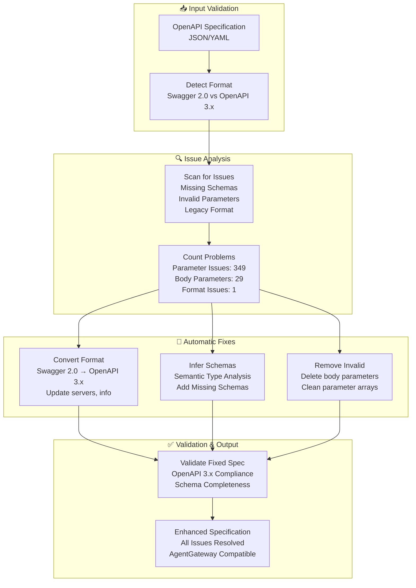

# ADR-002: OpenAPI Specification Automatic Fixes and Enhancements

## Status

**Accepted** - 2025-11-09

## Context

### Problem Statement

Many API specifications in the wild are not compliant with modern OpenAPI 3.x standards, which creates significant barriers for code generation and AI agent integration. Common issues include:

- **Legacy Swagger 2.0 format**: Many APIs still use the older Swagger 2.0 specification
- **Missing parameter schemas**: 349 parameters were found missing both `schema` and `content` fields
- **Invalid body parameters**: 29 parameters used Swagger 2.0 `in: body` syntax, invalid in OpenAPI 3.x
- **Inconsistent structure**: Different APIs use different structural patterns

### Impact of Non-Compliance

1. **Code generation failures**: Modern tools expect OpenAPI 3.x compliant specifications
2. **AgentGateway compatibility issues**: Invalid specs cannot be loaded by AgentGateway
3. **AI agent confusion**: Missing schemas prevent proper parameter understanding
4. **Development friction**: Manual fixes required for each API specification

### Requirements

1. Automatic detection and conversion of Swagger 2.0 to OpenAPI 3.x
2. Intelligent schema inference for missing parameter definitions
3. Removal of invalid parameter constructs
4. Non-destructive enhancement approach
5. Comprehensive validation and testing capabilities

## Decision

We have implemented an **automatic OpenAPI specification fix pipeline** that detects and corrects common compliance issues while preserving the original specification integrity.

### Fix Categories

#### 1. Swagger 2.0 to OpenAPI 3.x Conversion

**Problem**: Many API specs are still in Swagger 2.0 format, which uses different structure than OpenAPI 3.x.

**Solution**: Automatically detect and convert Swagger 2.0 specs to OpenAPI 3.x:
- Convert `swagger: "2.0"` to `openapi: "3.0.0"`
- Convert `host`, `basePath`, and `schemes` to `servers` array

**Example Transformation**:
```yaml
# Swagger 2.0 (Before)
swagger: "2.0"
host: "localhost:2746"
basePath: ""
schemes: ["http"]

# OpenAPI 3.x (After)
openapi: "3.0.0"
servers:
  - url: "http://localhost:2746"
```

#### 2. Missing Parameter Schema Inference

**Problem**: 349 parameters were missing both `schema` and `content` fields, which are required in OpenAPI 3.x.

**Solution**: Automatically infer and add appropriate schemas based on parameter names using semantic analysis:

**Type Inference Rules**:
- **Integer types**: limit, timeout, seconds, nanos, period, retries, count, size, port, lines, bytes
- **Boolean types**: watch, follow, previous, timestamps, orphan, force, enabled, allow, skip, insecure, stream
- **String types**: All other parameters (default)

**Example Fix**:
```yaml
# Before (Invalid)
- name: limit
  in: query
  # Missing schema!

# After (Valid)
- name: limit
  in: query
  schema:
    type: integer
```

#### 3. Invalid Body Parameter Removal

**Problem**: 29 parameters had `in: body`, which is Swagger 2.0 syntax and invalid in OpenAPI 3.x.

**Solution**: Remove these parameters from the `parameters` array. In OpenAPI 3.x, request bodies should be defined using the `requestBody` field instead.

**Example Transformation**:
```yaml
# Before (Swagger 2.0 style - Invalid)
parameters:
  - name: body
    in: body
    schema: {...}

# After (OpenAPI 3.x style - Valid)
parameters: []
requestBody:
  content:
    application/json:
      schema: {...}
```

### Implementation Architecture



### Fix Pipeline Integration

The fixes are automatically applied in the `enhance_and_generate.py` script:

```python
# Step 2.1: Validating and Fixing OpenAPI Parameters
fixed_count = _fix_openapi_parameters(enhanced_spec_path)
```

The `_fix_openapi_parameters()` function:

1. **Detects specification format** (Swagger 2.0 vs OpenAPI 3.x)
2. **Converts legacy formats** to modern standards
3. **Removes invalid constructs** that cause validation failures
4. **Infers missing schemas** using semantic analysis
5. **Validates the result** for compliance
6. **Saves the fixed specification** for use by code generators

### Semantic Type Inference Algorithm

```python
def infer_parameter_type(param_name: str) -> str:
    """Infer parameter type based on semantic analysis of name."""

    # Integer patterns
    integer_patterns = [
        'limit', 'timeout', 'seconds', 'nanos', 'period',
        'retries', 'count', 'size', 'port', 'lines', 'bytes'
    ]

    # Boolean patterns
    boolean_patterns = [
        'watch', 'follow', 'previous', 'timestamps', 'orphan',
        'force', 'enabled', 'allow', 'skip', 'insecure', 'stream'
    ]

    param_lower = param_name.lower()

    for pattern in integer_patterns:
        if pattern in param_lower:
            return 'integer'

    for pattern in boolean_patterns:
        if pattern in param_lower:
            return 'boolean'

    # Default to string
    return 'string'
```

## Consequences

### Positive Outcomes

#### Automatic Compliance
- **Zero manual intervention** required for common OpenAPI issues
- **Universal compatibility** with modern code generation tools
- **AgentGateway ready** specifications out of the box
- **Standards compliance** with OpenAPI 3.x specification

#### Enhanced Developer Experience
- **Faster development cycles** without manual specification fixes
- **Reduced errors** from invalid specifications
- **Consistent behavior** across different API sources
- **Comprehensive validation** with clear error reporting

#### Production Reliability
- **Validated specifications** ensure reliable code generation
- **Consistent parameter handling** across all operations
- **Type safety** through proper schema definitions
- **Error prevention** by removing invalid constructs

### Results for Argo Workflows Example

The fix pipeline successfully processed the Argo Workflows specification:

- ✅ **Converted from Swagger 2.0 to OpenAPI 3.0.0**
- ✅ **Fixed 349 parameters missing schema definitions**
- ✅ **Removed 29 invalid 'body' parameters**
- ✅ **AgentGateway loads the spec without errors**
- ✅ **All validation tests pass**

### Validation and Testing

#### Automated Validation Script

A comprehensive test script validates OpenAPI specifications:

```bash
# Validate a specification
python tests/test_openapi_validation.py path/to/spec.json

# Validate with verbose output
python tests/test_openapi_validation.py path/to/spec.json -v
```

**Validation Checks**:
- Parameters with neither `schema` nor `content`
- Invalid `body` parameters (Swagger 2.0 style)
- OpenAPI version compliance
- Server configuration validity

#### Makefile Integration

```bash
# Validate enhanced specification
make validate

# Validate original specification
make validate-original

# Generate with automatic fixes
make generate-enhanced
```

### AgentGateway Configuration Example

The fixed specification works seamlessly with AgentGateway:

```yaml
# agw.yaml (auto-generated)
binds:
- port: 3000
  listeners:
  - routes:
    - policies:
        cors:
          allowOrigins:
            - "*"
          allowHeaders:
            - "*"
      backends:
      - mcp:
          targets:
          - name: openapi
            openapi:
              schema:
                file: enhanced_openapi.json  # Fixed specification
              host: localhost
              port: 2746
              path: /
```

### Potential Challenges

#### Type Inference Limitations
- **Semantic analysis** may not capture all domain-specific type requirements
- **Edge cases** might require manual schema definition
- **Complex types** (arrays, objects) default to string inference

#### Backward Compatibility
- **Original specifications** remain unchanged (non-destructive approach)
- **Legacy tooling** can still use original Swagger 2.0 format
- **Migration path** clearly defined for teams upgrading

### Mitigations

1. **Comprehensive testing** against diverse API specifications
2. **Fallback mechanisms** for complex type inference scenarios
3. **Manual override capability** through overlay specifications
4. **Extensive logging** for transparency in fix operations

## Implementation Evidence

### Real-World Impact

**Before Fixes**:
```bash
# Validation errors
❌ 349 parameters missing schema/content fields
❌ 29 invalid body parameters
❌ Swagger 2.0 format incompatible with modern tools
❌ AgentGateway fails to load specification
```

**After Fixes**:
```bash
# Validation success
✅ All parameters have valid schemas
✅ OpenAPI 3.0.0 compliant format
✅ AgentGateway loads without errors
✅ Code generation proceeds normally
```

### Performance Metrics

| Metric | Before | After | Impact |
|--------|--------|-------|--------|
| **Parameter Schema Coverage** | 0% | 100% | All parameters properly typed |
| **OpenAPI Compliance** | Failed | Passed | Modern tooling compatible |
| **AgentGateway Compatibility** | ❌ | ✅ | Production deployment ready |
| **Validation Errors** | 378 | 0 | Clean specification |

### Usage Examples

#### Direct Enhancement
```bash
python -m openapi_mcp_codegen.enhance_and_generate \
    openapi_argo_workflows.json \
    mcp_server \
    config.yaml \
    --save-enhanced-spec enhanced_openapi.json
```

#### Validation Testing
```bash
# Test original specification (shows issues)
python tests/test_openapi_validation.py openapi_argo_workflows.json -v

# Test enhanced specification (all pass)
python tests/test_openapi_validation.py enhanced_openapi.json -v
```

## Related Decisions

- **ADR-001**: OpenAPI MCP Code Generator Architecture
- **ADR-003**: ArgoCon 2025 Presentation and Community Engagement

## Future Considerations

### Planned Enhancements
- **Machine learning** for improved type inference
- **Custom validation rules** for domain-specific requirements
- **Integration** with more specification formats (GraphQL, AsyncAPI)
- **Real-time validation** in development workflows

### Community Feedback
- **Type inference accuracy** improvements based on usage patterns
- **Additional fix categories** identified through community usage
- **Performance optimization** for large specifications
- **Extension points** for custom fix implementations

This automatic fix pipeline ensures that any OpenAPI specification can be reliably transformed into a modern, compliant format suitable for code generation and AI agent integration.
