# ADR-005: Enhanced OpenAPI Conversion for Swagger 2.0 Specifications

## Status
**Proposed** - 2024-11-09

## Context

The current `enhance_and_generate.py` script provides basic Swagger 2.0 to OpenAPI 3.x conversion capabilities, but encounters significant issues when processing complex real-world specifications like the Argo Workflows API.

### Current Limitations

Based on analysis of `argo-openapi.json` (771KB, 255 operations), we identified:

1. **Incomplete Swagger 2.0 Conversion**: Only handles basic fields (`swagger`, `basePath`, `schemes`, `host`)
2. **Invalid Body Parameters**: 29 parameters with `"in": "body"` are removed but not converted to proper `requestBody` sections
3. **Schema Validation Issues**: Parameters lack proper `schema` or `content` fields required by OpenAPI 3.x
4. **Limited Error Handling**: Insufficient validation and recovery mechanisms
5. **Manual Fixes Required**: Significant post-conversion cleanup needed

### Business Impact

- **Development Overhead**: Manual fixes required for each Swagger 2.0 specification
- **Error-Prone Process**: Inconsistent conversion results across different APIs
- **Limited Legacy Support**: Many enterprise APIs still use Swagger 2.0 format
- **Reduced Reliability**: MCP code generation fails on improperly converted specs

## Decision

We will implement a **hybrid approach** combining rule-based conversion with **iterative LLM-powered intelligence** to provide comprehensive, automated Swagger 2.0 to OpenAPI 3.x conversion.

### Core Improvements

#### 1. Complete Swagger 2.0 Schema Conversion
```yaml
# Convert all Swagger 2.0 constructs:
definitions -> components/schemas
parameters -> components/parameters
responses -> components/responses
securityDefinitions -> components/securitySchemes
# Update $ref paths: #/definitions/* -> #/components/schemas/*
```

#### 2. Intelligent Body Parameter Conversion
```yaml
# Transform body parameters to requestBody:
- Extract schema from body parameters
- Create proper requestBody with media types
- Preserve descriptions and examples
- Handle multiple content types (application/json, etc.)
```

#### 3. Enhanced Parameter Schema Fixing
```yaml
# Improved type inference:
- Pattern-based detection (timestamps, IDs, counts)
- OpenAPI convention compliance
- Array parameter handling with items
- Complex object parameter support
- Parameter reference resolution
```

#### 4. LLM-Powered Iterative Conversion
```yaml
# Intelligent conversion using existing LLM infrastructure:
- Leverage existing LLMFactory and prompt.yaml system
- Context-aware parameter type inference
- Smart schema transformation with validation
- Self-correcting through iterative refinement
- Preserve semantic meaning during conversion
```

#### 5. Comprehensive Validation Framework
```yaml
# Multi-stage validation:
- Pre-conversion spec validation
- Post-conversion OpenAPI 3.x compliance
- Parameter schema completeness check
- Reference integrity verification
- Rollback on conversion failure
```

## LLM-Powered Iterative Approach

### Leveraging Existing Infrastructure

The system already has robust LLM integration through:
- **LLMFactory from cnoe_agent_utils**: Multi-provider support (OpenAI, Anthropic, Google)
- **Declarative Prompts**: Sophisticated `prompt.yaml` configuration system
- **LangChain Integration**: Production-ready LLM pipeline with error handling

### Iterative Conversion Pipeline

```mermaid
flowchart LR
    A[Swagger 2.0 Spec] -->|1. Analyze| B[LLM Analyzer]
    B -->|2. Plan| C[Conversion Strategy]
    C -->|3. Apply| D[LLM Converter]
    D -->|4. Validate| E[OpenAPI 3.x Validator]
    E -->|5. Check| F{Valid?}
    F -->|No| G[LLM Refiner]
    G -->|6. Iterate| D
    F -->|Yes| H[Enhanced OpenAPI 3.x Spec]
    H --> I[openapi_enhancer.py]
    I --> J[Overlay Generator]
    J --> K[Overlay Applier]
    K --> L[MCP Code Generator]
    L --> M[Production MCP Server]

    style A fill:#f9f9f9
    style B fill:#e1f5ff
    style D fill:#fff4e6
    style G fill:#ffe1e1
    style H fill:#e8f5e9
    style I fill:#f3e5f5
    style M fill:#e8f5e9
```



### LLM Conversion Prompts

#### 1. Body Parameter Conversion
```yaml
# Addition to prompt.yaml
swagger_body_parameter_conversion:
  system_prompt: |
    You are an expert at converting Swagger 2.0 body parameters to OpenAPI 3.x requestBody format.

    CONVERSION RULES:
    1. Extract schema from body parameter
    2. Create requestBody with proper media types
    3. Preserve descriptions, examples, and constraints
    4. Handle array/object schemas correctly
    5. Use application/json as default media type

    INPUT: Swagger 2.0 body parameter object
    OUTPUT: Valid OpenAPI 3.x requestBody object (JSON format)

  user_prompt_template: |
    Convert this Swagger 2.0 body parameter to OpenAPI 3.x requestBody:

    Parameter: {body_parameter}
    Operation: {method} {path}

    Return only valid JSON requestBody object.
```

#### 2. Schema Type Inference
```yaml
schema_type_inference:
  system_prompt: |
    You are an expert at inferring parameter types from context and naming conventions.

    INFERENCE RULES:
    - Analyze parameter name patterns
    - Consider operation context
    - Use OpenAPI 3.x type system
    - Provide format specifiers when appropriate
    - Handle arrays with proper items definitions

  user_prompt_template: |
    Infer schema for parameter: {param_name}
    Location: {param_in}
    Operation: {operation_context}
    Original type: {original_type}

    Generate OpenAPI 3.x schema object (JSON).
```

### Iterative Refinement Process

1. **Initial Conversion**: Rule-based + LLM analysis
2. **Validation Pass**: Check OpenAPI 3.x compliance
3. **Error Analysis**: LLM identifies specific issues
4. **Targeted Fixes**: LLM generates precise corrections
5. **Re-validation**: Verify fixes maintain spec integrity
6. **Iteration Limit**: Maximum 3 refinement cycles

### Configuration Integration

```yaml
# config.yaml enhancement
conversion:
  enabled: true
  use_llm: true
  llm_provider: "openai"  # or anthropic, google
  max_iterations: 3
  batch_size: 10
  validation_strict: true
  preserve_extensions: true

  # LLM-specific settings
  llm_settings:
    temperature: 0.1  # Low for consistency
    max_tokens: 2000
    timeout: 30
    retry_attempts: 2
```

## Implementation Plan

### Phase 1: LLM-Powered Conversion Foundation
- [ ] Extend `prompt.yaml` with conversion-specific prompts
- [ ] Implement `LLMSwaggerConverter` class using existing LLMFactory
- [ ] Add body parameter → requestBody LLM conversion
- [ ] Implement iterative schema type inference
- [ ] Add conversion logging and statistics

### Phase 2: Validation and Refinement Loop
- [ ] Implement OpenAPI 3.x compliance validator
- [ ] Add LLM-powered error analysis and correction
- [ ] Create iterative refinement loop with max iterations
- [ ] Add backup and rollback mechanisms
- [ ] Integrate conversion caching for efficiency

### Phase 3: Integration and Optimization
- [ ] Test with argo-workflows specification (29 body parameters)
- [ ] Validate full pipeline: conversion → overlay → MCP generation
- [ ] Performance optimization for large specs (batch processing)
- [ ] Add configuration options for LLM provider selection
- [ ] Documentation and usage examples

## Consequences

### Positive
- **Intelligent Conversion**: LLM understands context and preserves semantic meaning
- **Self-Correcting**: Iterative refinement automatically fixes conversion issues
- **Automated Legacy Support**: Seamless handling of complex Swagger 2.0 specifications
- **Reduced Manual Effort**: Elimination of post-conversion fixes through smart inference
- **Enhanced Developer Experience**: One-command conversion with intelligent feedback
- **Contextual Understanding**: LLM leverages API patterns and naming conventions
- **Future-Proof**: Adapts to new OpenAPI features and edge cases

### Negative
- **LLM Dependencies**: Requires API keys and network connectivity for optimal performance
- **Cost Considerations**: LLM API calls add operational costs (mitigated by caching)
- **Performance Impact**: Additional LLM calls may increase processing time
- **Non-Deterministic Results**: LLM outputs may vary slightly between runs
- **Complexity**: More sophisticated pipeline with multiple components to maintain

### Risks and Mitigations
- **Risk**: Breaking existing OpenAPI 3.x specs
  **Mitigation**: Detect and skip conversion for already-valid specs
- **Risk**: Complex edge cases in real-world specifications
  **Mitigation**: Incremental rollout with comprehensive logging
- **Risk**: Performance degradation on large specifications
  **Mitigation**: Batch processing and LLM response caching
- **Risk**: LLM service unavailability or API limits
  **Mitigation**: Rule-based fallback system and graceful degradation

## Success Metrics

### Quantitative Metrics
- **Conversion Success Rate**: >95% for Swagger 2.0 specifications
- **Parameter Fix Rate**: 100% of parameters have valid schemas
- **Body Parameter Conversion**: 100% converted to proper requestBody
- **LLM Accuracy**: >90% first-pass correctness for schema inference
- **Iteration Efficiency**: \<2 average iterations per problematic operation
- **Performance**: \<25% increase in processing time (accounting for LLM calls)

### Qualitative Metrics
- **Developer Feedback**: Reduced support requests for conversion issues
- **Code Quality**: Generated MCP code compiles without manual fixes
- **Semantic Preservation**: LLM maintains API intent during conversion
- **Maintenance**: Reduced manual intervention in conversion pipeline

## Test Cases

### Primary Test Case: Argo Workflows
- **Input**: `examples/argo-workflows/argo-openapi.json` (Swagger 2.0, 771KB, 255 operations)
- **Expected**: Valid OpenAPI 3.x with all 29 body parameters converted
- **Validation**: Successful MCP code generation and compilation

### Additional Test Cases
- **Petstore API**: Basic Swagger 2.0 conversion validation
- **Complex Enterprise APIs**: Real-world specifications with edge cases
- **Already-Valid OpenAPI 3.x**: Ensure no regression in existing specs

## Implementation Details

### File Structure (Updated)

#### Current Unified Structure
```
openapi_mcp_codegen/
├── openapi_enhancer.py (unified: overlay generation + application + enhancement)
├── mcp_codegen.py (existing: MCP server code generation)
├── prompt.yaml (extended with conversion prompts)
└── templates/ (existing template directory)
```

#### Planned LLM Enhancement Structure
```
openapi_mcp_codegen/
├── openapi_enhancer.py (enhanced with LLM conversion)
├── conversion/ (new: LLM-powered conversion modules)
│   ├── __init__.py
│   ├── llm_converter.py (new: LLM conversion logic)
│   ├── iterative_refiner.py (new: refinement loop)
│   └── swagger_analyzer.py (new: Swagger 2.0 analysis)
├── validation/
│   ├── __init__.py
│   ├── openapi_validator.py (new: spec validation)
│   ├── conversion_validator.py (new: conversion verification)
│   └── llm_validator.py (new: LLM-based validation)
├── prompt.yaml (extended with conversion prompts)
└── templates/ (existing template directory)
```

**Consolidation Completed**:
- ✅ Merged `enhance_and_generate.py`, `overlay_applier.py`, `overlay_generator.py` → `openapi_enhancer.py`
- ✅ Unified CLI with subcommands: `enhance`, `generate-overlay`, `apply-overlay`
- ✅ Reduced codebase complexity while preserving all functionality

### Configuration Options
```yaml
# config.yaml enhancement options
conversion:
  enabled: true
  use_llm: true
  llm_provider: "openai"  # or anthropic, google
  max_iterations: 3
  batch_size: 10
  backup_original: true
  strict_validation: true
  rollback_on_failure: true
  log_conversion_stats: true
  preserve_extensions: true

  # LLM-specific settings
  llm_settings:
    temperature: 0.1  # Low for consistency
    max_tokens: 2000
    timeout: 30
    retry_attempts: 2
    enable_caching: true
```

## References

- [OpenAPI 3.0 Specification](https://swagger.io/specification/)
- [Swagger 2.0 to OpenAPI 3.0 Migration Guide](https://swagger.io/docs/specification/2-0/swagger-2-0-to-openapi-3-0/)
- [Argo Workflows OpenAPI Specification](../../examples/argo-workflows/argo-openapi.json)
- [ADR-004: OpenAPI Overlay Enhancement](./ADR-004-openapi-overlay-enhancement.md)
- [ADR-002: OpenAPI Specification Automatic Fixes and Enhancements](./ADR-002-openapi-specification-fixes.md)

## Approval

- **Author**: Assistant
- **Reviewers**: [To be assigned]
- **Decision Date**: [To be determined]
- **Review Date**: [To be scheduled after implementation]
