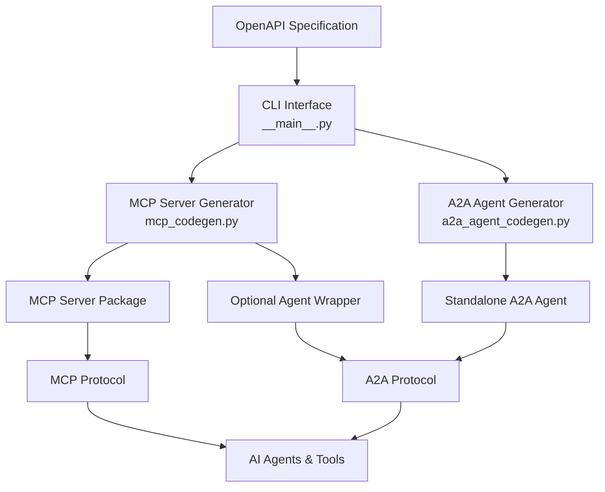
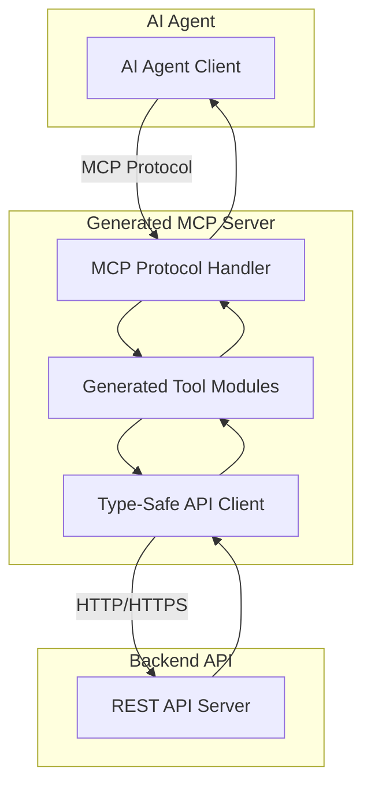
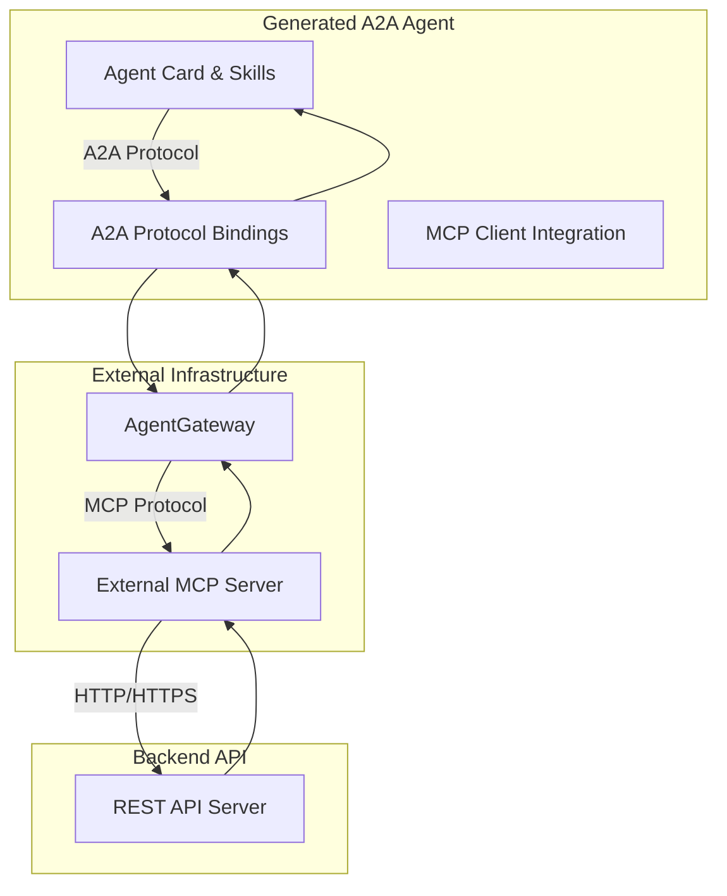

# Architecture

OpenAPI MCP Codegen provides a dual-generation architecture built around three core components that transform OpenAPI specifications into either MCP servers or A2A agents.

## Core Architecture

The system is built around **three main components**:

## Component Architecture

### 1. CLI Interface Layer (`__main__.py`)
- **Multi-command CLI**: Two primary generation modes
- **Configuration Management**: Handles config files and environment setup
- **Parameter Validation**: Validates inputs and provides user feedback

### 2. MCP Server Generation (`mcp_codegen.py`)
- **Type-Safe Code Generation**: Complete Python MCP servers with async support
- **Smart Parameter Handling**: Automatic complex schema detection and consolidation
- **LLM Enhancement**: AI-optimized docstrings and system prompt generation
- **Agent Wrapper**: Optional LangGraph agent with A2A bindings

### 3. A2A Agent Generation (`a2a_agent_codegen.py`)
- **Complete Agent Packages**: Full A2A-compatible agent structure
- **External MCP Integration**: Connects to existing MCP server infrastructure
- **Skills Architecture**: Structured capability definitions and examples
- **Protocol Bindings**: Support for different transport mechanisms

For detailed information on each component:
- [Core Components Overview](../core-components/)
- [MCP Server Generator](../core-components/mcp-server-generator.md)
- [A2A Agent Generator](../core-components/a2a-agent-generator.md)
- [Smart Parameter Handling](./smart-parameter-handling.md)

## Generation Architectures

### MCP Server Architecture

Generated MCP servers provide direct protocol exposure:

### A2A Agent Architecture

Generated A2A agents connect to external MCP infrastructure:

Both architectures enable seamless integration between AI agents and existing APIs, with different deployment and scaling characteristics.

## Design Principles

### 1. Dual Generation Approach
The system supports two distinct generation modes to address different deployment scenarios:

- **MCP Server Generation**: Self-contained servers for direct control and new integrations
- **A2A Agent Generation**: Distributed agents for existing MCP infrastructure

### 2. Type Safety and Production Readiness
All generated code includes:
- **Comprehensive Type Hints**: Full Python typing with proper async/await patterns
- **Error Handling**: Robust error management with logging and user feedback
- **Smart Parameter Management**: Automatic complex schema detection and consolidation
- **Code Quality**: Automatic formatting and linting with Ruff

### 3. LLM-Enhanced Intelligence
Both generation modes support AI optimization:
- **System Prompt Generation**: Domain-specific AI prompts using GPT-4/Claude
- **Enhanced Documentation**: AI-optimized function descriptions for better tool selection
- **Evaluation Frameworks**: Testing suites for agent performance measurement
- **Smart Documentation**: Context-aware descriptions that improve AI comprehension

### 4. Standards-Based Approach
The system follows established protocols and standards:
- **MCP Protocol Compliance**: Full Model Context Protocol implementation
- **A2A Protocol Support**: Standard Agent-to-Agent communication patterns
- **OpenAPI Standards**: Complete OpenAPI 3.0+ specification support
- **Python Standards**: PEP 8 compliance and modern Python practices

## Architecture Benefits

### Flexibility
- **Multiple Deployment Models**: Choose between self-hosted or distributed architectures
- **Protocol Agnostic**: Support for different transport mechanisms (HTTP, WebSocket, SLIM)
- **Scalability Options**: From single MCP servers to multi-agent systems

### Developer Experience
- **Zero-Config Generation**: From OpenAPI spec to running code in minutes
- **Comprehensive Tooling**: Generated Makefiles, configuration templates, and documentation
- **Testing Support**: Built-in evaluation frameworks and development tools
- **Clear Separation**: Distinct boundaries between generation logic and generated code

### Production Excellence
- **Enterprise Ready**: Type safety, error handling, and observability built-in
- **Maintainable Code**: Template-based generation with consistent patterns
- **Performance Optimized**: Async/await patterns and efficient parameter handling
- **Monitoring Ready**: Integration with LangFuse and other observability platforms