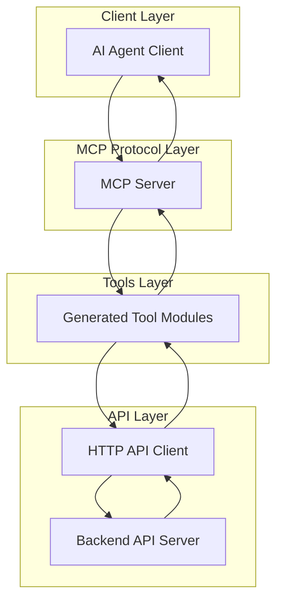

# Architecture

OpenAPI MCP Codegen provides a comprehensive architecture for transforming OpenAPI specifications into AI-ready MCP servers.

## Core Architecture

The generator follows a four-layer approach:

1. **Input & Configuration Layer**
2. **LLM Enhancement Pipeline**
3. **Code Generation Engine**
4. **Output & Integration Layer**

For detailed architecture information, see:
- [Architecture Overview](./overview.md)
- [Enhancement Pipeline](./enhancement-pipeline.md)
- [Code Generation](./code-generation.md)
- [Smart Parameter Handling](./smart-parameter-handling.md)

## Generated MCP Server Architecture

This architecture enables seamless integration between AI agents and existing APIs through the Model Context Protocol (MCP) standard.