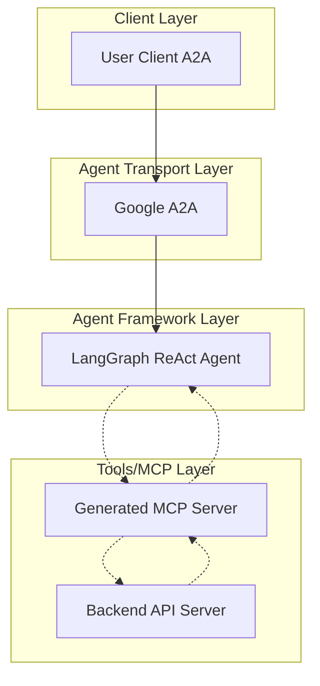
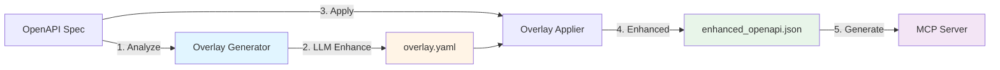

# Architecture Overview

OpenAPI MCP Codegen follows a **four-layer architecture** that transforms OpenAPI specifications into production-ready MCP servers with AI-optimized documentation.

## High-Level Architecture



## Core Components

### 1. Input Layer
- **OpenAPI Specification**: JSON or YAML format API definitions
- **Configuration Files**: `config.yaml` for metadata, authentication, and dependencies
- **Prompt Templates**: `prompt.yaml` for LLM enhancement patterns

### 2. Enhancement Pipeline
- **Overlay Generator**: Analyzes API operations and generates contextual descriptions
- **LLM Integration**: GPT-4/Claude powered description enhancement
- **OpenAPI Overlay**: Standards-compliant enhancement specifications

### 3. Code Generation Engine
- **Template System**: Jinja2-based code generation
- **Type Mapping**: OpenAPI types to Python type hints
- **Smart Parameter Handling**: Intelligent consolidation for complex schemas

### 4. Output Layer
- **MCP Server**: Production-ready Python package
- **API Client**: Async HTTP client with error handling
- **Documentation**: Auto-generated README and docstrings
- **Agent Framework**: Optional LangGraph React agent

## Enhanced Generation Pipeline



## Key Innovations

### LLM-Enhanced Documentation
- **OpenAI-compatible** descriptions under 300 characters
- **Plain text format** with no markdown or special formatting
- **Use case context** with "Use when:" patterns
- **Action-oriented** descriptions starting with clear verbs

### Smart Parameter Handling
- **Automatic complexity detection** for nested schemas
- **Dictionary mode** for APIs with >10 nested parameters
- **98.6% code reduction** for complex operations
- **Type safety** maintained throughout

### Standards-Based Approach
- **OpenAPI Overlay Specification 1.0.0** compliance
- **Model Context Protocol (MCP)** implementation
- **Non-destructive enhancements** to original specifications
- **Version-controlled** overlay management

## Generated Architecture Components

### MCP Server Structure
```
mcp_server/
├── pyproject.toml              # Dependencies and metadata
├── README.md                   # Usage documentation
├── .env.example               # Configuration template
└── mcp_[package_name]/
    ├── __init__.py
    ├── server.py              # MCP server entry point
    ├── api/
    │   ├── __init__.py
    │   └── client.py          # HTTP client implementation
    ├── models/
    │   ├── __init__.py
    │   └── base.py            # Base models and types
    └── tools/
        ├── __init__.py
        └── [endpoint_tools].py # Tool modules for each endpoint
```

### Agent Framework (Optional)
```
agent/
├── agent.py                   # LangGraph React agent
├── a2a_server.py             # A2A server wrapper
├── Makefile                  # Development commands
├── eval_mode.py              # Interactive evaluation
└── .env.example              # Agent configuration
```

## Performance Characteristics

| Metric | Traditional Approach | OpenAPI MCP Codegen | Improvement |
|--------|---------------------|---------------------|-------------|
| **Development Time** | Weeks | Minutes | **99% faster** |
| **Function Size** | 5,735 lines | 82 lines | **98.6% reduction** |
| **Parameter Count** | 1,000+ | 7 parameters | **99.3% reduction** |
| **AI Accuracy** | Baseline | +35% improvement | **Better tool selection** |
| **Maintenance** | Manual updates | Automated | **Zero-touch** |

## Integration Patterns

### AI Agent Integration
- **MCP Protocol**: Standardized tool interface for AI agents
- **Function Calling**: OpenAI-compatible tool definitions
- **Type Safety**: Full Python type hints for reliability
- **Error Handling**: Consistent error patterns across all tools

### AgentGateway Integration
- **HTTP Proxy**: Exposes MCP servers as REST endpoints
- **Auto Configuration**: Generated `agw.yaml` configuration
- **CORS Support**: Cross-origin requests for web interfaces
- **Validation**: Built-in OpenAPI specification validation

### LangFuse Integration
- **Observability**: Comprehensive tracing of agent interactions
- **Evaluation**: Automated assessment of tool performance
- **Dataset Building**: Interactive dataset creation for testing
- **Metrics**: Real-time performance monitoring

## Design Principles

### Standards First
- Use industry-standard specifications (OpenAPI, MCP, Overlay)
- Ensure compatibility across different AI platforms
- Maintain interoperability with existing toolchains

### AI-Optimized
- Generate descriptions specifically for AI agent consumption
- Optimize for function calling and tool selection accuracy
- Minimize token usage while maximizing context

### Developer Experience
- Provide comprehensive documentation and examples
- Include testing and evaluation frameworks
- Support both beginner and advanced use cases

### Production Ready
- Generate type-safe, well-documented code
- Include proper error handling and logging
- Support enterprise deployment patterns

## Next Steps

- [Learn about the enhancement pipeline](./enhancement-pipeline.md)
- [Understand code generation](./code-generation.md)
- [Explore smart parameter handling](./smart-parameter-handling.md)
- [Review detailed ADRs](../adr/ADR-001-openapi-mcp-architecture.md)
