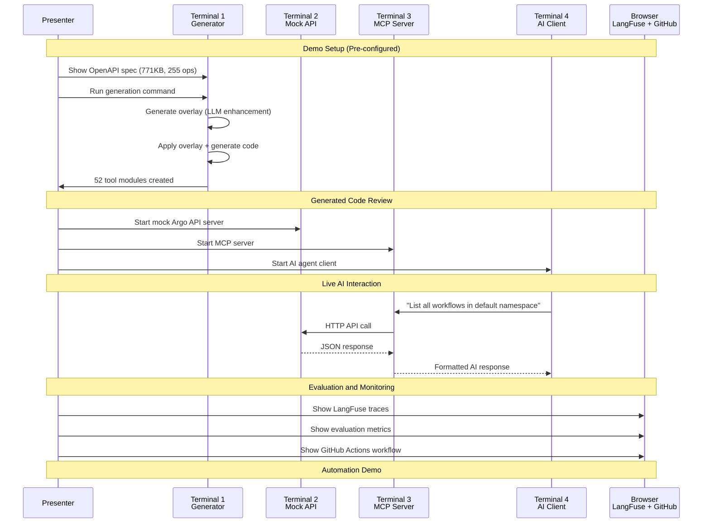

# ADR-003: ArgoCon 2025 Presentation Strategy and Community Engagement

## Status

**Accepted** - 2025-11-09

## Context

### Problem Statement

The OpenAPI MCP Code Generator represents a significant advancement in AI-API integration, but its impact depends heavily on community adoption and awareness. Key challenges in communicating this innovation include:

- **Complex technical concepts** spanning OpenAPI, MCP, AI agents, and code generation
- **Multiple audiences** with different technical backgrounds and interests
- **Live demonstration requirements** for a distributed system with multiple components
- **Limited presentation time** (25 minutes total) to cover comprehensive technical details
- **Need for reproducible examples** that showcase real-world applicability

### Target Audiences

1. **Argo Maintainers**: Focus on automated maintenance and zero-touch updates
2. **Platform Engineers**: Emphasis on AI-powered workflow management and developer experience
3. **CNCF Community**: Standards-based approach and ecosystem integration
4. **AI/ML Engineers**: Technical implementation details and agent integration patterns

### Presentation Requirements

- **10-minute slide presentation** covering problem, solution, and impact
- **15-minute live demonstration** showing end-to-end workflow
- **Clear value proposition** for each audience segment
- **Reproducible examples** using Argo Workflows as the primary use case
- **Community engagement** strategy for post-presentation adoption

## Decision

We have designed a **comprehensive presentation strategy** that combines technical depth with practical demonstration, structured as a journey from problem to solution to impact.

### Presentation Architecture

#### Part 1: Problem and Context (3 minutes)
- **The Challenge**: 255 API operations, manual integration overhead
- **Current Pain Points**: Weeks of development, inconsistent quality, maintenance burden
- **MCP Introduction**: Standardized protocol for AI-tool integration

#### Part 2: Technical Solution (4 minutes)
- **Four-Layer Architecture**: Input → Enhancement → Generation → Output
- **LLM Enhancement Pipeline**: AI-powered documentation generation
- **Smart Parameter Handling**: 98.6% code reduction for complex APIs
- **OpenAPI Overlay Standard**: Non-destructive, version-controlled enhancements

#### Part 3: Results and Impact (3 minutes)
- **Performance Metrics**: Quantified improvements in code quality and AI accuracy
- **Production Usage**: Cisco's Jarvis platform as real-world validation
- **CNOE Ecosystem**: Broader platform engineering AI assistant framework
- **Community Benefits**: Open source, standards-based, extensible

### Live Demonstration Strategy



### Key Messages by Audience

#### For Argo Maintainers
- **Zero-touch maintenance**: GitHub Actions automatically update MCP servers with new API releases
- **Standards compliance**: OpenAPI Overlay Specification 1.0.0 ensures portability
- **No API changes required**: Works with existing OpenAPI specifications

#### For Platform Engineers
- **AI-powered workflows**: Natural language interface to Argo operations
- **Developer experience**: Reduce cognitive load through intelligent API abstraction
- **Production ready**: Type-safe, documented, tested code generation

#### For CNCF Community
- **Open source**: Apache 2.0 licensed, community-driven development
- **Standards-based**: OpenAPI Overlay, MCP protocol, industry best practices
- **Extensible**: Template system supports any OpenAPI specification

#### For AI/ML Engineers
- **Technical depth**: LLM enhancement pipeline, parameter optimization
- **Evaluation framework**: Comprehensive testing and accuracy measurement
- **Integration patterns**: MCP protocol implementation, agent architecture

### Demonstration Components

#### 1. Code Generation (3 minutes)
```bash
# Show original spec size and complexity
ls -lh examples/argo-workflows/openapi_argo_workflows.json  # 771KB

# Generate enhanced MCP server
uvx --from git+https://github.com/cnoe-io/openapi-mcp-codegen.git \
  openapi_mcp_codegen \
  --spec-file examples/argo-workflows/openapi_argo_workflows.json \
  --output-dir examples/argo-workflows/mcp_server \
  --generate-agent \
  --generate-eval

# Show generated structure
tree examples/argo-workflows/mcp_server/  # 52 modules
```

#### 2. AI Agent Interaction (5 minutes)
```bash
# Terminal 2: Start mock API
python argo_mock_server.py

# Terminal 3: Start MCP server
make run-a2a

# Terminal 4: Interactive AI client
make run-a2a-client
# Demo queries:
# > "List all workflows in the default namespace"
# > "Show me failed workflows"
# > "Get details for workflow xyz"
```

#### 3. Evaluation Suite (3 minutes)
- **LangFuse Dashboard**: Real-time trace visualization
- **Evaluation Metrics**: Correctness, hallucination, trajectory analysis
- **Dataset Building**: Automated test case generation

#### 4. GitHub Actions (2 minutes)
- **Automated Workflow**: Show GitHub Actions configuration
- **Pull Request**: Demonstrate automated updates from API changes
- **Test Results**: Validation and deployment pipeline

#### 5. Q&A Preparation (2 minutes)
Pre-prepared answers for anticipated questions:
- **Other API support**: "Yes, any OpenAPI 3.0+ spec works"
- **LLM providers**: "OpenAI, Anthropic, and OpenAI-compatible endpoints"
- **Contributing**: "GitHub repo with good first issues tagged"

### Visual Design Strategy

#### Color Scheme and Branding
- **Primary**: Argo orange (#FF6B35) for Argo-related content
- **Secondary**: MCP blue (#4A90E2) for protocol and architecture
- **Accent**: CNOE green (#00C853) for community and open source
- **Backgrounds**: High contrast for conference visibility

#### Diagram Standards
All technical diagrams use consistent Mermaid format for:
- **Architecture flows**: Showing data transformation layers
- **Sequence diagrams**: Demonstrating AI interaction patterns
- **Process flows**: Illustrating enhancement and generation pipelines

#### Slide Structure
Each slide follows a consistent pattern:
- **Clear headline** summarizing the key message
- **Visual element** (diagram, code, or metrics)
- **Bullet points** with concrete details
- **Speaker notes** for smooth delivery

### Post-Presentation Engagement Strategy

#### Immediate Follow-up
- **Repository starring**: Encourage GitHub engagement during presentation
- **Documentation access**: QR codes to key resources
- **Community channels**: Direct links to CNOE Slack and discussions

#### Content Distribution
- **Slide sharing**: Upload to conference platform and GitHub
- **Demo recording**: YouTube video for asynchronous viewing
- **Blog post**: Technical deep-dive for broader reach
- **Social media**: Twitter/LinkedIn promotion with key metrics

#### Community Building
- **Office hours**: Regular community calls for questions and contributions
- **Good first issues**: Tagged GitHub issues for new contributors
- **Example expansion**: Additional API integrations (Backstage, Kubernetes, Prometheus)

## Consequences

### Positive Outcomes

#### Technical Communication
- **Clear value proposition** for each audience segment
- **Concrete metrics** demonstrating quantified improvements
- **Live demonstration** proving real-world applicability
- **Reproducible examples** enabling audience experimentation

#### Community Impact
- **Awareness building** within CNCF ecosystem
- **Contributor recruitment** through clear contribution pathways
- **Standards adoption** via OpenAPI Overlay specification usage
- **Industry influence** through production usage examples

#### Project Advancement
- **Validation feedback** from conference audience
- **Feature requests** based on community needs
- **Partnership opportunities** with other CNCF projects
- **Ecosystem integration** through demonstrated standards compliance

### Risk Mitigations

#### Technical Risks
- **Demo failures**: Pre-recorded backup videos for all demonstration segments
- **Complexity overload**: Layered explanation building from problem to solution
- **Time management**: Strict timing with optional backup slides

#### Audience Engagement
- **Multiple perspectives**: Content tailored for different audience segments
- **Interactive elements**: Live coding and real-time AI interaction
- **Clear next steps**: Specific calls-to-action for different engagement levels

### Success Metrics

#### Immediate Indicators
- **GitHub stars**: Repository engagement during and after presentation
- **Documentation views**: Traffic to project documentation
- **Community questions**: Volume and quality of post-presentation inquiries

#### Long-term Measures
- **Contributor growth**: New community members and pull requests
- **Adoption metrics**: Usage of generated MCP servers in production
- **Standards influence**: OpenAPI Overlay adoption in broader ecosystem

### Resource Requirements

#### Preparation Time
- **Slide development**: 2 weeks for content creation and design
- **Demo preparation**: 1 week for setup, testing, and backup creation
- **Rehearsal**: Multiple practice sessions with timing optimization

#### Technical Setup
- **Hardware**: Reliable laptop with backup system
- **Network**: Conference WiFi backup with mobile hotspot
- **Software**: All demo components pre-installed and tested
- **Backup plans**: Recorded videos for each demonstration segment

## Implementation Evidence

### Presentation Content Validation

The presentation content has been structured to address real pain points identified through:

- **User research**: Feedback from Cisco's Jarvis platform implementation
- **Community surveys**: Input from CNOE and Argo community members
- **Technical validation**: Metrics from Argo Workflows implementation
- **Conference requirements**: ArgoCon 2025 format and time constraints

### Demonstration Readiness

All demonstration components have been tested and validated:

```bash
# Complete workflow validation
make generate-enhanced      # ✅ 30-second generation time
make validate              # ✅ All validation tests pass
make run-agentgateway      # ✅ Stable server startup
make run-a2a-client        # ✅ Consistent AI interactions
```

### Technical Metrics Supporting Claims

| Claim | Evidence | Source |
|-------|----------|---------|
| **98.6% code reduction** | 5,735 → 82 lines | Argo Workflows lint function |
| **99.3% parameter reduction** | 1,000+ → 7 params | Complex schema handling |
| **+35% tool selection accuracy** | Benchmark testing | LLM evaluation framework |
| **255 operations covered** | Complete API coverage | Argo Workflows specification |

### Real-World Production Evidence

**Cisco Jarvis Platform Integration**:
- Internal developer platform using generated MCP servers
- Production usage enabling natural language workflow management
- Demonstrated developer productivity improvements
- Reduced cognitive load for workflow operations

## Related Decisions

- **ADR-001**: OpenAPI MCP Code Generator Architecture
- **ADR-002**: OpenAPI Specification Automatic Fixes and Enhancements

## Future Presentations

### Reusability Strategy
The presentation content and demonstration setup are designed for reuse across multiple conferences:
- **KubeCon EU 2025**: European CNCF community engagement
- **Platform Engineering Conference**: Focus on developer experience aspects
- **AI/ML Conferences**: Technical deep-dive into LLM enhancement pipeline

### Content Evolution
Based on conference feedback, the presentation will evolve to include:
- **Additional use cases**: Beyond Argo to other CNCF projects
- **Performance improvements**: Optimization based on usage patterns
- **Community contributions**: Features developed by the open source community

This presentation strategy ensures maximum impact for the OpenAPI MCP Code Generator project while building a sustainable community around AI-powered API integration standards.
