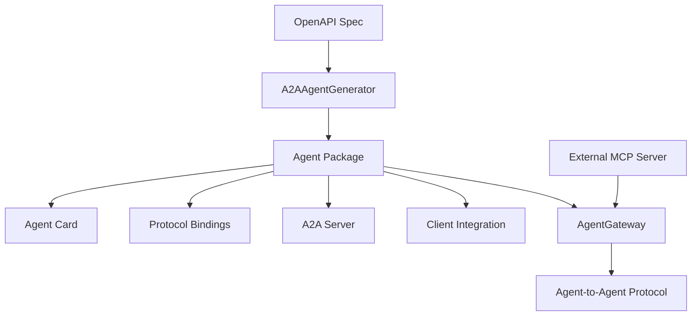

# A2A Agent Generator

The `A2AAgentGenerator` class in `a2a_agent_codegen.py` creates standalone Agent-to-Agent (A2A) compatible agents that connect to external MCP servers, enabling distributed agent architectures and integration with systems like AgentGateway.

## Overview

The A2A Agent Generator creates complete, standalone agent packages that can connect to any external MCP server. Unlike the MCP Server Generator which creates self-contained MCP servers, A2A agents are designed to work with existing MCP server infrastructure.

## Architecture



## Key Features

### Complete Agent Package Structure

Generated agents follow the standard A2A agent structure:

```
agent_name/
├── agent_name/              # Main agent package
│   ├── __init__.py
│   ├── __main__.py
│   ├── agentcard.py         # Agent capabilities definition
│   ├── protocol_bindings/   # Protocol implementations
│   │   └── a2a_server/      # A2A server implementation
│   └── utils/               # Utility functions and prompts
├── clients/                 # Client implementations
│   └── a2a/                 # A2A client code
├── pyproject.toml           # Python project configuration
├── Makefile                 # Development automation
├── README.md                # Documentation
├── langgraph.json           # LangGraph configuration
└── .env.example             # Environment template
```

### Skills-Based Architecture

A2A agents use a structured skills approach for capability definition:

```python
# From config.yaml or auto-generated from OpenAPI operations
skills = [
    {
        "name": "Workflow Management",
        "description": "Create, monitor, and manage workflows",
        "examples": [
            "Create a new workflow",
            "Check workflow status",
            "List running workflows"
        ]
    },
    {
        "name": "Artifact Management",
        "description": "Handle workflow artifacts and outputs",
        "examples": [
            "Download workflow artifacts",
            "List artifact contents",
            "Get artifact metadata"
        ]
    }
]
```

### AgentGateway Integration

Generated agents are designed to work seamlessly with AgentGateway:

- **Standard A2A Protocol**: Compatible with A2A specification
- **MCP Server Connection**: Connects to external MCP servers via HTTP/WebSocket
- **Protocol Bindings**: Complete protocol implementation for different transports
- **Configuration**: Pre-configured for AgentGateway deployment

## Generated Components

### 1. Agent Card (`agentcard.py`)

Defines agent capabilities and metadata:

```python
class AgentCard:
    name: str = "agent_name"
    display_name: str = "Agent Display Name"
    description: str = "Agent description"
    skills: List[Dict[str, Any]] = [...]
    system_prompt: str = "Domain-specific system prompt"
    mcp_server_url: str = "http://external-mcp-server:3000"
```

### 2. Protocol Bindings (`protocol_bindings/a2a_server/`)

Complete A2A server implementation:

- **Agent Implementation**: Core agent logic using LangGraph
- **Agent Executor**: Request handling and tool execution
- **Base Classes**: Integration with `cnoe_agent_utils.agents`
- **Protocol Compliance**: Full A2A protocol support

### 3. System Prompt Generation

Intelligent system prompt creation:

**Priority Order:**
1. **Config System Prompt**: Use `system_prompt` from `config.yaml` if provided
2. **LLM Generation**: Generate using LLM if `--generate-system-prompt` used
3. **Fallback**: Auto-generated from agent name and capabilities

**Example LLM-Generated Prompt:**
```text
You are an Argo Workflows expert assistant. You help users manage and
interact with Argo Workflows services.

Your capabilities include:
- Managing workflow resources and configurations
- Monitoring workflow status and performance
- Handling API operations and data retrieval
- Troubleshooting issues and providing solutions
- Providing best practices and recommendations

Always provide clear, actionable responses and include relevant resource
names, status information, and next steps when available.
```

### 4. Client Integration (`clients/a2a/`)

A2A client for external integration:
- **Agent Interface**: Standard A2A client implementation
- **HTTP/WebSocket Support**: Multiple transport options
- **Error Handling**: Comprehensive error management
- **Configuration**: Environment-based configuration

### 5. Development Tooling

Complete development environment:

**Makefile Targets:**
```makefile
dev:           Setup development environment
run-a2a:       Start A2A server
run-a2a-client: Start A2A client
test:          Run tests
lint:          Code linting
format:        Code formatting
```

## Configuration

### Required Configuration (`config.yaml`)

```yaml
# Agent Information
title: argo_workflows
author: Your Team
author_email: team@example.com

# Skills Definition (optional - can auto-generate from OpenAPI)
skills:
  - name: "Workflow Management"
    description: "Create and manage Argo Workflows"
    examples:
      - "Create a new workflow from template"
      - "Check workflow execution status"
      - "List all workflows in namespace"

# System Prompt (optional - can be LLM-generated)
system_prompt: |
  You are an Argo Workflows expert assistant...
```

### Environment Configuration (`.env.example`)

```bash
# Agent Configuration
AGENT_NAME=argo_workflows
MCP_SERVER_URL=http://localhost:3000

# LLM Configuration (for system prompt generation)
OPENAI_API_KEY=sk-...
ANTHROPIC_API_KEY=sk-ant-...

# Tracing (optional)
LANGFUSE_HOST=http://localhost:3000
LANGFUSE_PUBLIC_KEY=pk-...
LANGFUSE_SECRET_KEY=sk-...
```

## Usage Patterns

### 1. Basic A2A Agent Generation

```bash
uvx openapi_mcp_codegen generate-a2a-agent-with-remote-mcp \
  --spec-file argo-workflows.json \
  --agent-name "Argo Workflows" \
  --mcp-server-url "http://agentgateway:3000"
```

**Use Case:** Connect to existing MCP server deployed via AgentGateway

### 2. Custom Agent with Description

```bash
uvx openapi_mcp_codegen generate-a2a-agent-with-remote-mcp \
  --spec-file kubernetes.json \
  --agent-name "Kubernetes Manager" \
  --mcp-server-url "http://k8s-mcp-server:3000" \
  --agent-description "Intelligent Kubernetes cluster management agent"
```

**Use Case:** Specialized agent with custom description and capabilities

### 3. Development Mode

```bash
# Generate with dry-run for testing
uvx openapi_mcp_codegen generate-a2a-agent-with-remote-mcp \
  --spec-file api.json \
  --agent-name "test_agent" \
  --mcp-server-url "http://localhost:3000" \
  --dry-run
```

**Use Case:** Test generation without writing files

## Development Workflow

### 1. Generate Agent

```bash
# Create A2A agent for external MCP server
uvx openapi_mcp_codegen generate-a2a-agent-with-remote-mcp \
  --spec-file examples/argo-workflows/openapi_argo_workflows.json \
  --agent-name "Argo Workflows Expert" \
  --mcp-server-url "http://agentgateway:3000/argo-workflows"
```

### 2. Setup Development Environment

```bash
cd agent_argo_workflows_expert
make dev                    # Setup environment
cp .env.example .env        # Configure environment
# Edit .env with your settings
```

### 3. Start Agent Server

```bash
# Start A2A server
make run-a2a

# Server starts on default port with A2A protocol support
# Connects to external MCP server at configured URL
```

### 4. Test Integration

```bash
# In separate terminal, test with A2A client
make run-a2a-client

# Or integrate with AgentGateway
curl -X POST http://localhost:8000/agents/argo_workflows/invoke \
  -H "Content-Type: application/json" \
  -d '{"message": "List all workflows in default namespace"}'
```

## Integration Scenarios

### With AgentGateway

**Architecture:**
```
A2A Agent ←→ AgentGateway ←→ External MCP Server
```

**Benefits:**
- Centralized agent management
- Protocol translation
- Load balancing and scaling
- Monitoring and observability

### Direct MCP Server Connection

**Architecture:**
```
A2A Agent ←→ MCP Server (HTTP/WebSocket)
```

**Benefits:**
- Direct communication
- Lower latency
- Simplified deployment
- Full MCP protocol access

### Multi-Agent System

**Architecture:**
```
Multiple A2A Agents ←→ Agent Orchestrator ←→ Multiple MCP Servers
```

**Benefits:**
- Specialized agent capabilities
- Distributed processing
- Fault isolation
- Scalable architecture

## Advanced Features

### LLM Integration

A2A agents support LLM integration for:
- **System Prompt Generation**: AI-optimized prompts for specific domains
- **Capability Descriptions**: Enhanced skill descriptions
- **Dynamic Responses**: Context-aware agent responses

### Skills Configuration

Flexible skills definition:

**From Config:**
```yaml
skills:
  - name: "Advanced Operations"
    description: "Complex multi-step operations"
    examples:
      - "Deploy application with monitoring"
      - "Rollback deployment with verification"
```

**Auto-Generated from OpenAPI:**
```python
# Automatically extracted from operation summaries
for operation in openapi_operations:
    skill_examples.append(operation.summary)
```

### Protocol Bindings

Support for multiple transport protocols:
- **HTTP**: RESTful API integration
- **WebSocket**: Real-time communication
- **A2A Protocol**: Standard agent-to-agent communication

## Troubleshooting

### Common Issues

**Connection Failures:**
- Verify MCP server URL is accessible
- Check network connectivity and firewall rules
- Validate MCP server is running and healthy
- Review authentication/authorization settings

**Configuration Errors:**
- Validate `config.yaml` syntax and required fields
- Check environment variable configuration
- Verify agent name follows Python package naming rules
- Review system prompt and skills definitions

**Generation Issues:**
- Ensure OpenAPI specification is valid
- Check write permissions for output directory
- Verify all required dependencies are installed
- Review error logs for specific failure details

### Performance Optimization

**Agent Response Time:**
- Use efficient MCP server connections
- Implement connection pooling
- Cache frequently accessed data
- Optimize skill matching algorithms

**Resource Usage:**
- Monitor memory usage for large operation sets
- Use appropriate timeout configurations
- Implement graceful degradation for failures
- Consider agent instance scaling

### Debugging

**Enable Debug Logging:**
```bash
export LOG_LEVEL=debug
make run-a2a
```

**Connection Testing:**
```bash
# Test MCP server connectivity
curl -X GET $MCP_SERVER_URL/health

# Test agent capabilities
curl -X POST http://localhost:8000/capabilities
```

## Best Practices

### Configuration Management

- Use environment variables for URLs and secrets
- Store skills definitions in version-controlled config
- Document required environment variables
- Provide working `.env.example` templates

### Agent Design

- Keep agent responsibilities focused and clear
- Use descriptive names for agents and capabilities
- Provide comprehensive skill examples
- Test with representative use cases

### Deployment

- Use container deployments for consistency
- Implement health checks and monitoring
- Configure appropriate resource limits
- Plan for scaling and load balancing

### Maintenance

- Monitor agent performance and accuracy
- Update skills definitions as APIs evolve
- Test agent behavior with evaluation frameworks
- Keep dependencies and base images updated
