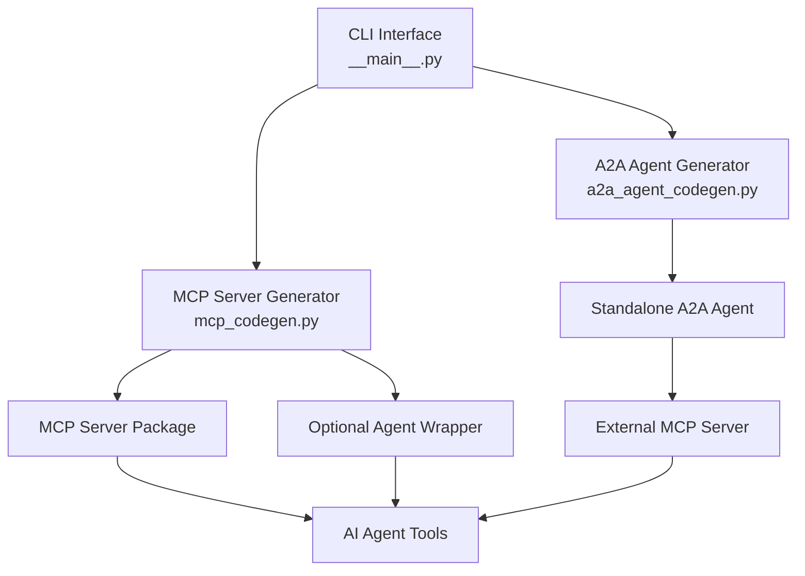

# Core Components

OpenAPI MCP Codegen is built around three main components that provide comprehensive code generation capabilities for MCP servers and A2A agents.

## Architecture Overview



## Component Overview

### 1. CLI Interface (`__main__.py`)

The command-line interface provides two primary commands:

- **`generate-mcp`**: Creates MCP servers with optional agent wrappers
- **`generate-a2a-agent-with-remote-mcp`**: Creates standalone A2A agents

**Key Features:**
- Multi-command CLI with Click framework
- Environment variable loading
- Configuration file management
- Dry-run support for testing

### 2. MCP Server Generator (`mcp_codegen.py`)

Transforms OpenAPI specifications into production-ready MCP servers.

**Key Features:**
- Smart parameter handling for complex schemas
- Type-safe Python code generation
- LLM-enhanced documentation
- Optional agent wrapper generation
- Evaluation framework creation

**Generated Output:**
- Complete MCP server package
- API client and data models
- Tool modules for each endpoint
- Optional LangGraph agent wrapper
- Development and deployment tooling

### 3. A2A Agent Generator (`a2a_agent_codegen.py`)

Creates standalone A2A agents that connect to external MCP servers.

**Key Features:**
- Complete agent package structure
- Skills-based architecture
- Protocol bindings for different transports
- AgentGateway compatibility
- LLM-generated system prompts

**Generated Output:**
- Standalone A2A agent package
- Protocol bindings and client integration
- Agent card with capability definitions
- Development tooling and configuration

## Comparison: MCP Server vs A2A Agent

| Aspect | MCP Server Generator | A2A Agent Generator |
|--------|---------------------|---------------------|
| **Purpose** | Self-contained MCP servers | Agents for external MCP servers |
| **Deployment** | Direct MCP protocol exposure | Connects to existing MCP infrastructure |
| **Use Case** | New API integration | Existing MCP server utilization |
| **Architecture** | Monolithic MCP server | Distributed agent system |
| **AgentGateway** | Requires gateway for A2A | Native A2A compatibility |

## Generation Workflows

### MCP Server Generation Workflow

1. **Parse OpenAPI Spec**: Load and validate OpenAPI specification
2. **Generate Core Components**: Create API client, models, and tools
3. **Create MCP Server**: Generate MCP protocol implementation
4. **Optional Enhancements**: Add agent wrapper, evaluation, system prompts
5. **Code Quality**: Apply formatting, linting, and type checking

### A2A Agent Generation Workflow

1. **Parse OpenAPI Spec**: Analyze API capabilities and operations
2. **Extract Skills**: Generate capability definitions from operations
3. **Create Agent Package**: Generate complete A2A agent structure
4. **Configure Connectivity**: Set up external MCP server connection
5. **Generate Tooling**: Create development and deployment automation

## Shared Features

Both generators share common capabilities:

### Smart Parameter Handling
- Automatic detection of complex parameter schemas
- Dictionary mode for >10 nested parameters
- Support for OpenAPI composition patterns (`allOf`, `oneOf`, `anyOf`)
- Clean function signatures that are AI-friendly

### LLM Enhancement
- System prompt generation using GPT-4/Claude
- Enhanced docstring generation for better AI comprehension
- Evaluation framework creation for testing agent performance
- AI-optimized descriptions for function calling

### Code Quality
- Type-safe Python code with comprehensive type hints
- Automatic formatting with Ruff (140-character line length)
- Comprehensive error handling and logging
- Production-ready async/await patterns

### Template System
- Jinja2-based code generation
- Customizable templates for different output formats
- Consistent code structure and patterns
- Maintainable and extensible generation logic

## Development Patterns

### Configuration-Driven Generation

Both generators use `config.yaml` for customization:

```yaml
# Common configuration
title: api_name
description: API description
author: Your Team
version: 1.0.0

# MCP Server specific
headers:
  Authorization: Bearer {token}

# A2A Agent specific
skills:
  - name: "Capability Name"
    examples: ["Example operation"]
system_prompt: "Custom agent prompt"
```

### Environment-Based Runtime

Generated code uses environment variables for runtime configuration:

```bash
# API Configuration
API_URL=https://api.example.com
API_TOKEN=your-token

# LLM Configuration (for enhancements)
OPENAI_API_KEY=sk-...
ANTHROPIC_API_KEY=sk-ant-...

# Tracing (optional)
LANGFUSE_HOST=http://localhost:3000
```

### Consistent Development Experience

Both generators produce projects with:
- **Makefile**: Standardized development commands
- **pyproject.toml**: Modern Python project configuration
- **.env.example**: Environment variable templates
- **README.md**: Comprehensive usage documentation

## Integration Points

### With AgentGateway

- **MCP Servers**: Deployed behind AgentGateway for A2A protocol exposure
- **A2A Agents**: Direct integration with AgentGateway infrastructure
- **Protocol Translation**: Gateway handles MCP ↔ A2A protocol conversion

### With Agent Chat CLI

Both generated outputs work with `agent-chat-cli` for testing:

```bash
# Test MCP server directly
uvx agent-chat-cli --mcp-server stdio --server-command "python -m mcp_server"

# Test A2A agent
uvx agent-chat-cli --a2a-agent http://localhost:8000
```

### With Evaluation Frameworks

Generated agents support evaluation with:
- **OpenEvals**: Standardized evaluation datasets
- **AgentEvals**: Agent-specific evaluation metrics
- **LangFuse**: Conversation tracing and analysis
- **Custom Metrics**: Domain-specific performance measures

## Next Steps

- [Learn about MCP Server Generation](./mcp-server-generator.md)
- [Understand A2A Agent Creation](./a2a-agent-generator.md)
- [Explore CLI Commands](../cli/commands.md)
- [See Usage Examples](../examples/)
