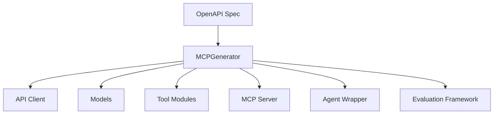

# MCP Server Generator

The `MCPGenerator` class in `mcp_codegen.py` is the core component responsible for transforming OpenAPI specifications into production-ready MCP (Model Context Protocol) servers.

## Overview

The MCP Server Generator provides comprehensive code generation capabilities that transform any OpenAPI 3.0+ specification into a fully functional MCP server with optional agent wrappers, evaluation frameworks, and LLM-enhanced documentation.

## Core Architecture



## Key Features

### Smart Parameter Handling

The generator implements intelligent parameter handling for complex schemas:

- **Automatic Detection**: Identifies schemas with >10 nested parameters
- **Dictionary Mode**: Consolidates complex parameters into `Dict[str, Any]` types
- **98.6% Code Reduction**: Transforms 1000+ parameter functions into clean, usable interfaces
- **Composition Support**: Handles `allOf`, `oneOf`, `anyOf` schema patterns

**Example:**
```python
# Instead of 1000+ individual parameters
async def complex_kubernetes_operation(
    body_metadata: Dict[str, Any] = None,
    body_spec: Dict[str, Any] = None
) -> Any:
    """Clean interface for complex Kubernetes-style schemas"""
```

### Type-Safe Code Generation

All generated code includes:
- **Full Type Hints**: Complete typing with `Any`, `Dict`, `List`, `Optional` where appropriate
- **Async/Await Support**: Modern Python async patterns for HTTP operations
- **Error Handling**: Comprehensive error handling with logging and user-friendly messages
- **Pydantic Models**: Type-safe models for request/response validation

### LLM-Enhanced Documentation

When enabled, the generator can enhance function documentation:

- **AI-Optimized Descriptions**: Function descriptions optimized for AI agent comprehension
- **OpenAPI Integration**: Optionally includes OpenAPI specifications in docstrings
- **Parallel Processing**: Concurrent LLM enhancement for faster generation
- **Error Recovery**: Graceful fallback when LLM enhancement fails

## Generated Components

### 1. API Client (`api/client.py`)

Async HTTP client with:
- Environment variable configuration
- Header management
- Request/response logging
- Error handling and retry logic

```python
async def make_api_request(
    path: str,
    method: str = "GET",
    params: Dict = None,
    json_data: Dict = None
) -> Tuple[bool, Dict]:
    """Core API request function with error handling"""
```

### 2. Data Models (`models/`)

Pydantic-based models for:
- Request/response schemas
- Parameter validation
- Type safety
- Serialization/deserialization

### 3. Tool Modules (`tools/`)

Each OpenAPI path becomes a tool module with:
- Individual functions for each operation
- Smart parameter extraction and naming
- Documentation optimized for AI agents
- Consistent error handling

**Function Pattern:**
```python
async def {operation_id}(
    path_{param}: str,
    param_{query_param}: str = None,
    body_{field}: Dict[str, Any] = None
) -> Any:
    """
    Operation summary from OpenAPI spec

    Args:
        path_param: Path parameter description
        param_query_param: Query parameter description
        body_field: Request body field description

    Returns:
        Any: API response data
    """
```

### 4. MCP Server (`server.py`)

Complete MCP server implementation:
- Tool registration for all generated functions
- MCP protocol compliance
- Environment configuration
- Logging and error handling

### 5. Agent Wrapper (Optional)

When `--generate-agent` is specified:
- **LangGraph Integration**: React agent wrapper using LangGraph
- **A2A Server Bindings**: Agent-to-Agent protocol support
- **System Prompt**: LLM-generated or configured system prompts
- **Evaluation Framework**: Testing and evaluation capabilities

## Configuration Options

### Required Configuration (`config.yaml`)

```yaml
# Package Information
title: petstore
description: Petstore API MCP Server
author: Your Name
email: you@example.com
version: 0.1.0

# API Authentication
headers:
  Authorization: Bearer {token}
  Accept: application/json
```

### Optional Enhancements

```yaml
# System Prompt (optional - can be LLM-generated)
system_prompt: |
  You are an expert assistant for the Petstore API.
  You help users manage pet store operations including
  pet inventory, orders, and user management.

# Skills Configuration (optional)
skills:
  - name: "Pet Management"
    description: "Manage pet inventory and information"
    examples:
      - "Find pets by status"
      - "Add a new pet to the store"
      - "Update pet information"
```

## Generation Modes

### 1. Basic MCP Server

```bash
uvx openapi_mcp_codegen generate-mcp \
  --spec-file api.json \
  --output-dir ./mcp_server
```

**Generated:**
- MCP server package
- API client and models
- Tool modules for each endpoint
- Configuration templates

### 2. Complete Agent System

```bash
uvx openapi_mcp_codegen generate-mcp \
  --spec-file api.json \
  --output-dir ./agent_system \
  --generate-agent \
  --generate-eval \
  --generate-system-prompt
```

**Generated:**
- Everything from basic mode
- LangGraph agent wrapper
- A2A server implementation
- Evaluation framework
- LLM-generated system prompt

### 3. LLM-Enhanced Generation

```bash
export OPENAI_API_KEY=your-key
uvx openapi_mcp_codegen generate-mcp \
  --spec-file api.json \
  --output-dir ./enhanced_server \
  --enhance-docstring-with-llm \
  --enhance-docstring-with-llm-openapi
```

**Features:**
- AI-optimized function documentation
- Enhanced parameter descriptions
- OpenAPI specs in docstrings
- Better agent tool selection

## Advanced Features

### WebSocket Proxy Support

```bash
uvx openapi_mcp_codegen generate-mcp \
  --spec-file api.json \
  --with-a2a-proxy
```

Generates WebSocket upstream server for A2A deployments.

### SLIM Transport Support

```bash
uvx openapi_mcp_codegen generate-mcp \
  --spec-file api.json \
  --enable-slim
```

Enables SLIM transport layer for enhanced agent communication.

## Code Quality

### Automatic Linting

All generated Python code is automatically:
- Formatted with **Ruff** (line length 140)
- Linted with **Ruff** (auto-fix enabled)
- Type-checked with proper hints
- Documented with comprehensive docstrings

### Template System

Uses **Jinja2** templates for:
- Consistent code structure
- Customizable generation patterns
- Maintainable template updates
- Different output formats

## Integration Examples

### With Agent Chat CLI

```bash
# Start the MCP server
cd generated_mcp_server
uv run python -m mcp_petstore.server

# In another terminal, connect with agent-chat-cli
uvx agent-chat-cli --mcp-server stdio --server-command "uv run python -m mcp_petstore.server"
```

### With AgentGateway

The generated MCP servers work seamlessly with AgentGateway for centralized agent management and API exposure.

### With LangFuse

Generated agents include optional LangFuse integration for:
- Conversation tracing
- Performance monitoring
- Agent behavior analysis
- Evaluation metrics

## Best Practices

### Configuration Management

- Store `config.yaml` in version control
- Use environment variables for secrets
- Provide `.env.example` templates
- Document required environment variables

### Development Workflow

1. **Generate Code**: Use appropriate generation mode
2. **Configure Environment**: Set up API credentials and URLs
3. **Test Locally**: Validate with mock or development APIs
4. **Deploy**: Use generated Docker/deployment configurations

### Maintenance

- Regenerate when OpenAPI specs change
- Review generated code for domain-specific customizations
- Update prompts for better LLM enhancement
- Monitor agent performance with evaluation frameworks

## Troubleshooting

### Common Issues

**Large Parameter Lists:**
- Enable smart parameter handling (automatic for >10 params)
- Use dictionary mode for complex schemas
- Review generated parameter consolidation

**LLM Enhancement Failures:**
- Check API key configuration
- Verify network connectivity
- Review error logs for specific failures
- Use `--dry-run` for testing

**Type Errors:**
- Regenerate with latest templates
- Check OpenAPI spec validity
- Review custom type mappings

### Performance Optimization

- Use concurrent LLM enhancement for large APIs
- Enable parameter consolidation for complex schemas
- Consider splitting large APIs into multiple MCP servers
- Use caching for repeated generation
