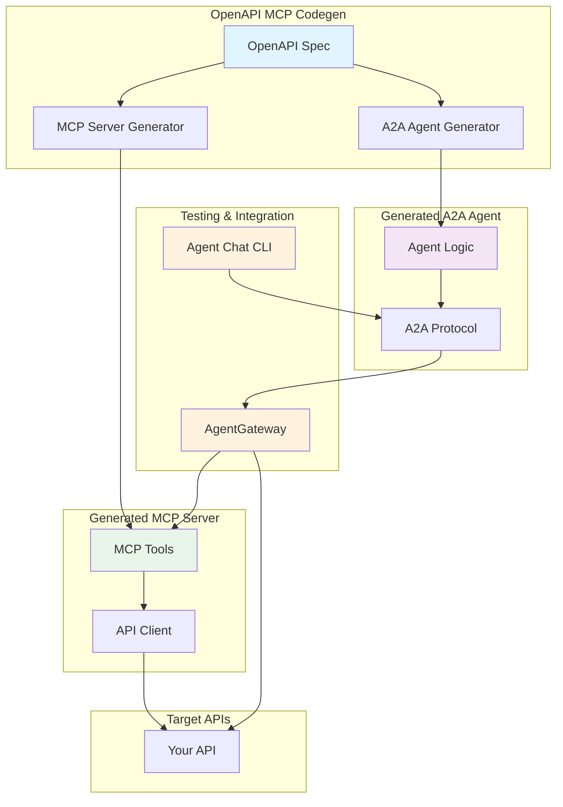

# Setup Guides

This section provides comprehensive setup guides for different aspects of the OpenAPI MCP Codegen toolkit.

## Available Guides

### [Testing with Agent Chat CLI](testing-with-agent-chat-cli.md)
**Learn how to test your generated A2A agents using the CNOE Agent Chat CLI**

This guide covers:
- Setting up the Agent Chat CLI
- Testing A2A agents interactively
- Debugging and troubleshooting
- Automated testing strategies
- Production deployment considerations

**Use this guide when:** You've generated an A2A agent and want to test it with a user-friendly chat interface.

---

## Quick Reference

### Generate A2A Agent

```bash
uv run python -m openapi_mcp_codegen generate-a2a-agent \
  --spec-file your-openapi.json \
  --agent-name "your_service" \
  --mcp-server-url "http://localhost:3000" \
  --agent-description "Your service description"
```

### Test with Agent Chat CLI

```bash
# Setup agent
cd agent_your_service
make dev
make run-a2a

# Test with chat CLI
git clone https://github.com/cnoe-io/agent-chat-cli.git
cd agent-chat-cli
uv sync
uv run python -m agent_chat_cli a2a --host localhost --port 8000
```

### Generate MCP Server

```bash
uv run python -m openapi_mcp_codegen generate-mcp \
  --spec-file your-openapi.json \
  --output-dir ./mcp_server \
  --generate-agent
```

## Architecture Overview



## Getting Help

- **GitHub Issues**: [Report bugs or request features](https://github.com/cnoe-io/openapi-mcp-codegen/issues)
- **Documentation**: Browse the full documentation in the `docs/` directory
- **Examples**: Check the `examples/` directory for working examples

## Contributing

We welcome contributions to these setup guides! Please:

1. Follow the existing documentation style
2. Include working code examples
3. Test all commands and procedures
4. Update the index when adding new guides

### Guide Template

When creating new setup guides, use this structure:

```markdown
# Guide Title

Brief description of what this guide covers.

## Prerequisites

- List required software
- List required knowledge
- List required setup

## Quick Start

1. Step 1 with commands
2. Step 2 with commands
3. Step 3 with commands

## Detailed Instructions

### Section 1
Detailed explanation...

### Section 2
Detailed explanation...

## Troubleshooting

Common issues and solutions...

## Next Steps

What to do after completing this guide...
```
