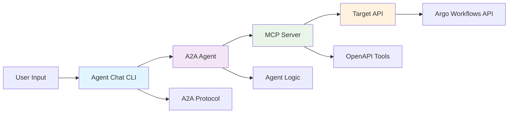

# Testing A2A Agents with Agent Chat CLI

This guide demonstrates how to test your generated A2A agents using the [CNOE Agent Chat CLI](https://github.com/cnoe-io/agent-chat-cli), a multi-protocol chat interface that supports A2A agents.

## Prerequisites

- Generated A2A agent (using `generate-a2a-agent` command)
- Running MCP server (like AgentGateway)
- Python 3.13+
- `uv` package manager

## Quick Start

### 1. Generate an A2A Agent

First, generate an A2A agent that connects to your MCP server:

```bash
# Generate A2A agent for Argo Workflows
uv run python -m openapi_mcp_codegen generate-a2a-agent \
  --spec-file examples/argo-workflows/argo-openapi-enhanced-compliant.json \
  --agent-name "argo_workflows" \
  --mcp-server-url "http://localhost:3000" \
  --agent-description "Manages Argo Workflows through AgentGateway" \
  --output-dir ./agent_argo_workflows
```

### 2. Setup and Start Your A2A Agent

```bash
# Navigate to the generated agent directory
cd agent_argo_workflows

# Setup environment (creates .venv, .env, installs dependencies)
make dev

# Edit .env with your API keys
vi .env

# Start the A2A agent
make run-a2a
```

Your agent will be available at `http://localhost:8000`

### 3. Install and Use Agent Chat CLI

Clone and setup the Agent Chat CLI:

```bash
# Clone the agent-chat-cli repository
git clone https://github.com/cnoe-io/agent-chat-cli.git
cd agent-chat-cli

# Install with uv
uv sync

# Test connection to your agent
uv run python -m agent_chat_cli a2a --host localhost --port 8000
```

## Detailed Testing Workflow

### Architecture Overview



### Step-by-Step Testing

#### 1. Verify Agent Status

```bash
# Check if your agent is running
curl -X GET http://localhost:8000/health

# Expected response: Agent health status
```

#### 2. Interactive Chat Testing

Start an interactive session with your agent:

```bash
# Interactive mode
uv run python -m agent_chat_cli a2a --host localhost --port 8000

# The CLI will show a welcome message and prompt
```

#### 3. Test Agent Capabilities

Try these example queries with your Argo Workflows agent:

```bash
# List capabilities
What actions can you perform?

# List workflows
Show me all workflows in the default namespace

# Get workflow details
Get details for workflow "my-workflow" in namespace "default"

# Create a workflow
Create a simple hello-world workflow

# Check workflow status
What is the status of workflow "my-workflow"?
```

#### 4. Test with Different Input Methods

**Piped Input:**
```bash
echo "List all workflows" | uv run python -m agent_chat_cli a2a --host localhost --port 8000
```

**File Input:**
```bash
echo "Get workflow status for hello-world" > test-query.txt
cat test-query.txt | uv run python -m agent_chat_cli a2a --host localhost --port 8000
```

### Debugging and Troubleshooting

#### Enable Debug Mode

**Agent Side:**
```bash
# In your agent directory
export DEBUG=true
export LOG_LEVEL=DEBUG
make run-a2a
```

**Chat CLI Side:**
```bash
# Enable debug logging
export A2A_DEBUG_CLIENT=true
uv run python -m agent_chat_cli a2a --host localhost --port 8000 --debug
```

#### Debug Output Example

```bash
DEBUG: Received user input: list workflows
DEBUG: Connecting to agent at http://localhost:8000
DEBUG: Successfully connected to agent
DEBUG: Created payload with message ID: abc123...
DEBUG: Sending streaming message to agent...
DEBUG: Received streaming chunk #1: <class 'a2a.types.SendStreamingMessageResponse'>
DEBUG: Processing event: <class 'a2a.types.Task'>, has status: True
DEBUG: Extracted text from status: ''
DEBUG: Received streaming chunk #2: <class 'a2a.types.SendStreamingMessageResponse'>
DEBUG: Processing event: <class 'a2a.types.TaskArtifactUpdateEvent'>, has status: False
DEBUG: Found artifact: <class 'a2a.types.Artifact'>, has parts: True
DEBUG: Added text from part.root.text: 'Here are the available workflows...'
```

#### Common Issues and Solutions

**Issue: Connection Failed**
```
Error: Failed to connect to agent at http://localhost:8000
```
**Solutions:**
- Ensure your A2A agent is running (`make run-a2a`)
- Check if port 8000 is available (`lsof -i :8000`)
- Verify agent configuration in `.env`

**Issue: Agent Not Responding**
```
Error: Agent timeout or no response
```
**Solutions:**
- Check MCP server connectivity (`curl http://localhost:3000`)
- Verify API keys in `.env` file
- Check agent logs for errors

**Issue: Invalid Response Format**
```
Error: Could not parse agent response
```
**Solutions:**
- Update to latest agent-chat-cli version
- Check A2A protocol compatibility
- Verify agent response format

### Configuration Options

#### Agent Chat CLI Environment Variables

| Variable | Default | Description |
|----------|---------|-------------|
| `A2A_HOST` | localhost | Agent server hostname |
| `A2A_PORT` | 8000 | Agent server port |
| `A2A_TOKEN` | "" | Authentication token (optional) |
| `A2A_TLS` | false | Enable TLS/HTTPS |
| `A2A_DEBUG_CLIENT` | false | Enable debug logging |

#### Command Line Options

```bash
uv run python -m agent_chat_cli a2a [OPTIONS]

Options:
  --host TEXT     Agent host (overrides A2A_HOST)
  --port INTEGER  Agent port (overrides A2A_PORT)
  --token TEXT    Authentication token (overrides A2A_TOKEN)
  --debug         Enable debug logging
  --help          Show help message
```

### Testing Different Scenarios

#### 1. Multi-turn Conversations

Test context retention across multiple queries:

```bash
# Start interactive session
uv run python -m agent_chat_cli a2a --host localhost --port 8000

# Query 1
> Create a workflow named "test-workflow"

# Query 2 (should remember context)
> What is the status of that workflow?

# Query 3
> Delete the workflow we just created
```

#### 2. Error Handling

Test how your agent handles various error conditions:

```bash
# Test with invalid namespace
> List workflows in namespace "nonexistent"

# Test with malformed request
> Delete workflow "" in namespace ""

# Test with permission errors
> Create workflow with invalid specifications
```

#### 3. Performance Testing

Test agent responsiveness:

```bash
# Time simple queries
time echo "list workflows" | uv run python -m agent_chat_cli a2a --host localhost --port 8000

# Test with complex queries
time echo "show me detailed status of all workflows with their logs" | uv run python -m agent_chat_cli a2a --host localhost --port 8000
```

## Advanced Testing

### Automated Testing Scripts

Create test scripts for regression testing:

```bash
#!/bin/bash
# test-agent.sh

AGENT_HOST="localhost"
AGENT_PORT="8000"

# Test basic connectivity
echo "Testing agent connectivity..."
curl -f http://${AGENT_HOST}:${AGENT_PORT}/health || exit 1

# Test basic queries
test_queries=(
    "What can you do?"
    "List all workflows"
    "Show me workflow status"
)

for query in "${test_queries[@]}"; do
    echo "Testing: $query"
    echo "$query" | uv run python -m agent_chat_cli a2a --host $AGENT_HOST --port $AGENT_PORT
    echo "---"
done
```

### Load Testing

Test agent performance under load:

```bash
# Install hey for load testing
go install github.com/rakyll/hey@latest

# Test agent endpoint
hey -n 100 -c 10 http://localhost:8000/health
```

### Integration Testing

Test full end-to-end workflow:

1. Start MCP server (AgentGateway)
2. Start A2A agent
3. Run agent-chat-cli tests
4. Verify API calls reach target system
5. Clean up test resources

## Production Deployment

### Containerized Testing

Create Docker setup for testing:

```dockerfile
# Dockerfile.test
FROM python:3.13-slim

# Install uv
COPY --from=ghcr.io/astral-sh/uv:latest /uv /bin/uv

# Setup working directory
WORKDIR /app

# Copy agent files
COPY agent_argo_workflows/ ./agent_argo_workflows/
COPY agent-chat-cli/ ./agent-chat-cli/

# Install dependencies
RUN cd agent_argo_workflows && uv sync
RUN cd agent-chat-cli && uv sync

# Start services
CMD ["bash", "-c", "cd agent_argo_workflows && uv run python -m agent_argo_workflows --host 0.0.0.0 --port 8000"]
```

### Monitoring and Metrics

Add monitoring to your test setup:

```bash
# Monitor agent health
watch -n 5 'curl -s http://localhost:8000/health | jq .'

# Monitor response times
while true; do
    start=$(date +%s%N)
    echo "ping" | uv run python -m agent_chat_cli a2a --host localhost --port 8000 >/dev/null
    end=$(date +%s%N)
    echo "Response time: $(( (end - start) / 1000000 )) ms"
    sleep 5
done
```

## Best Practices

### 1. Test Design

- **Start Simple**: Test basic connectivity before complex queries
- **Incremental Complexity**: Gradually increase query complexity
- **Error Cases**: Always test error conditions and edge cases
- **Context Testing**: Verify multi-turn conversation handling

### 2. Environment Management

- **Isolated Testing**: Use separate environments for testing
- **Configuration Management**: Use `.env` files for different test scenarios
- **Cleanup**: Always clean up test resources after testing

### 3. Automation

- **Regression Tests**: Create automated test suites
- **CI/CD Integration**: Include agent testing in your pipeline
- **Performance Baselines**: Establish performance benchmarks

### 4. Documentation

- **Test Cases**: Document expected behaviors and test cases
- **Known Issues**: Track and document known limitations
- **Usage Examples**: Provide realistic usage examples

## Troubleshooting Guide

### Common Error Patterns

| Error | Cause | Solution |
|-------|--------|----------|
| `Connection refused` | Agent not running | Start agent with `make run-a2a` |
| `404 Not Found` | Wrong endpoint | Verify agent URL and port |
| `401 Unauthorized` | Missing auth | Configure authentication tokens |
| `Timeout` | Slow response | Check MCP server performance |
| `Invalid JSON` | Response format | Update agent or chat CLI |

### Log Analysis

**Agent Logs:**
```bash
# View agent logs
cd agent_argo_workflows
tail -f logs/agent.log

# Search for errors
grep -i error logs/agent.log
```

**Chat CLI Logs:**
```bash
# Enable verbose logging
export A2A_DEBUG_CLIENT=true
uv run python -m agent_chat_cli a2a --debug 2>&1 | tee chat-cli.log
```

## Resources

- [CNOE Agent Chat CLI Repository](https://github.com/cnoe-io/agent-chat-cli)
- [A2A Protocol Documentation](https://docs.agntcy.org/)
- [MCP Specification](https://mcp.org/)
- [OpenAPI Specification](https://spec.openapis.org/oas/v3.0.3/)

## Next Steps

After successful testing:

1. **Deploy to staging environment**
2. **Set up monitoring and alerting**
3. **Create user documentation**
4. **Plan production rollout**
5. **Establish maintenance procedures**
